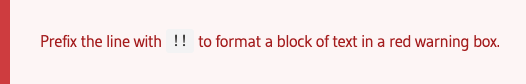

# Layershift KB

This repo hosts the contents of [Layershift's public knowledgebase](https://kb.layershift.com).

# Contributing

We actively encourage your edits, corrections, and clarifications to our documentation! To do so, simply edit the corresponding page in this repo and submit a pull request briefly describing your changes.

Please submit an issue if you notice a problem but don't feel like fixing it yourself, or there's something you want us to explain that's not currently covered.

## Page structure 

* Each chapter has its own numerically ordered folder, determining its position in the navigation sidebar, and a `chapter.en.md` page summarising its content.
  * A chapter may optionally have sub-chapters, which work in the same manner.
* Each documentation page within a chapter also has its own numerically ordered folder, containing a `docs.en.md` page and any media (images) required by that page.

### Page metadata

A short metadata block is required at the top of each `chapter.en.md` and `docs.en.md` page:
```
---
title: 'The page title'
visibile: true
metadata:
    description: 'A short 140-160 character summary of the page content, used in search engine listings. Make it accurate, informative, and concise - just like your content.'
---
```

### Contents

A table of contents block is automatically generated at the top of each documentation page, using the section headings and subheadings.

## Formatting

Documentation is written in [markdown](https://www.markdownguide.org/cheat-sheet/) and markdown extra. So it mostly works like other markdown-powered sites you may be familiar with (such as GitHub), but there are a few additional and notable formatting features we want to draw your attention to:

### Notice

```
! Prefix the line with `!` to format a block of text in an orange notice box.
```
Gives:  


### Warning
```
!! Prefix the line with `!!` to format a block of text in a red warning box.
```
Gives:  


### Info
```
!!! Prefix the line with `!!!` to format a block of text in a blue info box.
```
Gives:  


### Tip / Recommendation
```
!!!! Prefix the line with `!!!!` to format a block of text in a green tip box.
```
Gives:  


### Highlighting

#### Text
Enclose [mark]text that you want to highlight[/mark] in BBcode style `[mark]` `[/mark]` tags to highlight that text with a yellow background (like a highlighter pen).

#### Code blocks

Thanks to the excellent highlight.js jQuery plugin, you can simply:
```
Wrap code in a ``` block to have pretty highlighted code
```
or specify the language highligher to use immediately after the ``` fence
````
```js
// so this
```
````
```js
// becomes this
```

## Images

Images should usually be placed in the same folder as the page it's used on, and simply referenced in markdown like this:
```

```

## Tables

We use the [tables syntax described here](https://www.markdownguide.org/extended-syntax/#tables) including the alignment options, and the [Markdown tables generator site](https://www.tablesgenerator.com/markdown_tables) is a great resource to make things easier!

## Icons

You can embed [Font Awesome Icons](https://fontawesome.com/icons?d=gallery&m=free) into your documentation with the help of BBcode style `[fa=check /]` syntax (in this case embeds the [check icon](https://fontawesome.com/icons/check?style=solid).

### Colours

You can wrap anything in BBcode style `[color=#3ab31c]anything[/color]` tags to set its colour. This can be combined with the icon code in order to colour your icons, for example to give a green check (tick) icon:
```
[color=#3ab31c][fa=check /][/color]
```
or a red [cross icon](https://fontawesome.com/icons/times?style=solid):
```
[color=#c10000][fa=times /][/color]
```
