# Managing email account using Plesk Panel

All our [Cloud VPS](https://www.layershift.com/managed-cloud-vps) plans come with an integrated mail server which allows you to host and manage your mailboxes using the industry-leading Plesk Panel. This control panel is very easy and intuitive to use but we would still like to show you how quickly it is to create, configure and access an email account in Plesk, so you can have your mailbox up an running in minutes!

## Creating a new email address

As a first step, log in into your Plesk Dashboard either by using the IP address of your server or the server name( e.g.: https://serverhostname:8443 or https://serverIPaddress:8443 ):

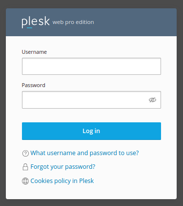

After you successfully logged in, access **Domains** (which is located on the left-hand side of the screen) and select the domain for which you want to create the email address. For this tutorial, I will select **domain3.com**:

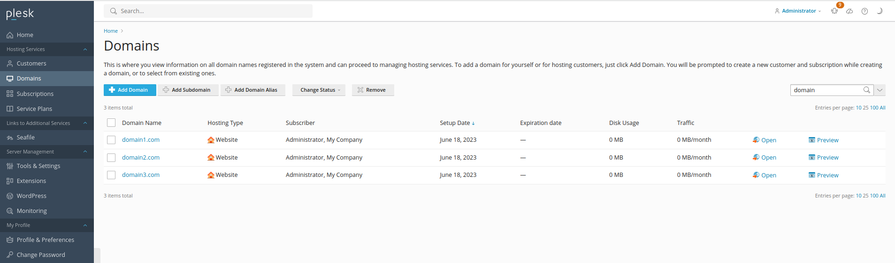

Navigate to the **Mail** tab and select **Mail Accounts**:

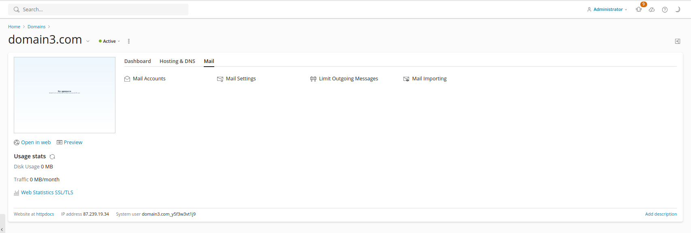

Select **Create Email  Address**:

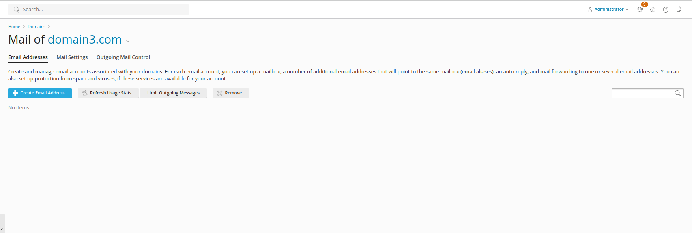

On the following screen you will be prompted to create your new email account. Just type in the desired username in front of the ‘@’ box and select the domain name for which you wish to add the email address, from the drop-down menu.

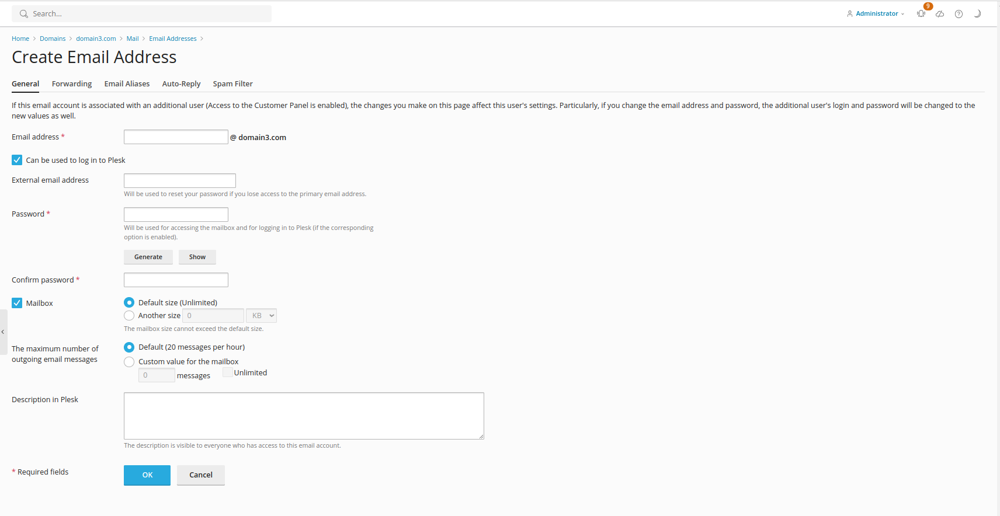

Leave the **Access to the Control Panel** check box ticked if you wish to create a new user for the Plesk Panel using this email address and give the mail account owner access to your server.

If this is an email account that you will be using frequently, you should leave the Mailbox check box selected. If you are using this email account as a placeholder for a different email address (for example you have an official company email but you wish to receive all the emails on your personal email address instead), then you won’t need a Mailbox, just configure email forwarding for this account.

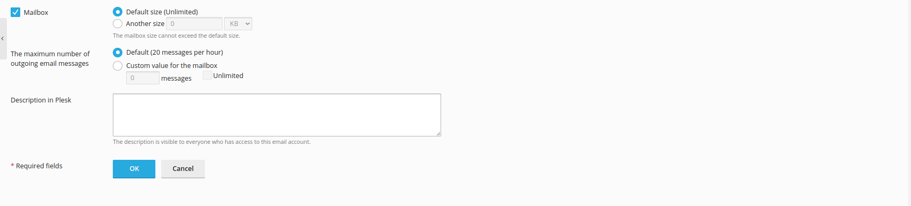

By default, all email accounts are created without any storage limits, but if you’re a hosting reseller (or simply want to make sure that your colleagues / collaborators’ email accounts don’t use all the disk space on your server) then you might need to specify a mailbox limit for each account. To achieve this, click the Another Size option and mention the desired mailbox size, depending on your requirements and the disk space capacity of your VPS.

Choose a password, confirm it and click OK.

Congrats ! Your new email account has been created.

## Accessing your inbox

There are a few ways you can access your newly created email account:

#### From Plesk, using one of the Webmail clients available

TO-DO: link default webmail client config article (please remove after you do it)

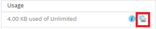

Click on the small Envelope icon next to your email address to open webmail and access your inbox.

#### Directly from your browser

Just type **http://webmail.domain.com**(where domain.com is a substitute for your actual domain name) in the navigation bar. This will take you to the login screen where you will need to fill in the email address you wish to access and the password you selected while creating the account.

**Example:**
Username: email@tutorials.com
Password: insert-your-password-here

#### Using an external mail client

We have a separate [article](https://kb.layershift.com/configure-plesk-mail) showing how you how to connect your Plesk email accounts with other mail clients.

## Forwarding emails

To forward your emails, just click on your newly created email address and select the Forwarding tab.

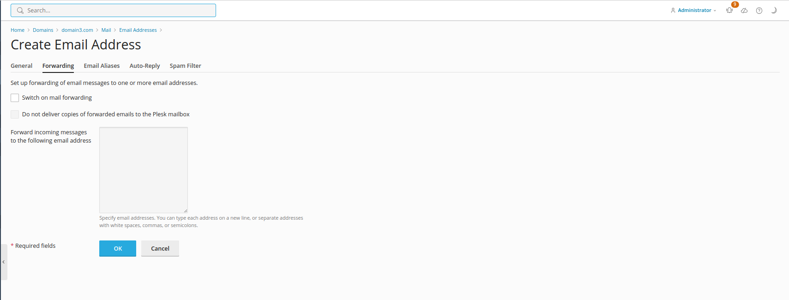

You will be able to add as many forwarding email addresses as you wish, just separate them using a new line, commas or white spaces. Now just tick the Switch on mail forwarding box and that’s it!

If your mailbox is switched on under the General tab, all your emails will get to the primary email address, but also to the email addresses you add to the forwarding list.

If you switch the mailbox off, the emails will be received by the forwarding email addresses only and no copies will reach the primary email address.

## Setting up aliases

Email aliases are alternative email addresses associated with your primary email address. All mail sent to email aliases will be received by the primary email address (e.g. if you add info@domain3.com, sales@domain3.com and help@domain3.com as aliases for admin@domain3.com all messages sent to any of these accounts will go the admin@domain3.com email address.)

You can create aliases for your primary email account from the **Email Aliases** tab:

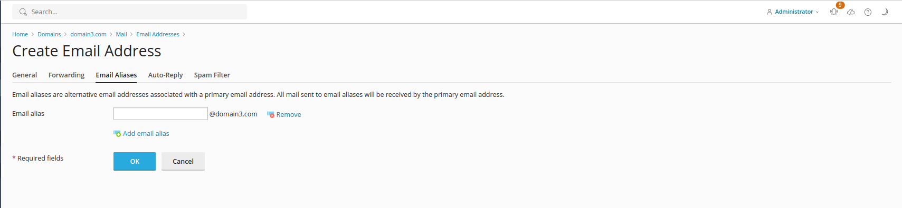

You can add as many email aliases as you wish by clicking on the **Add email alias** tab.

_Please keep in mind that the email alias you add to your primary email must be created on the same domain name as the primary email address. 
_

## Configuring Auto-Reply

The Auto-reply option allows you to set up an automatic response to any inbound message that reaches your email address. This is very useful in case you are out of office or on vacation.
You can easily set your automatic-reply by going to the Auto-Reply tab.

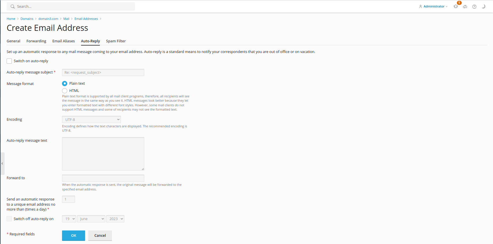

## Spam Filtering

The Spam Filter option allows you to separate the genuine emails sent to your email address from all the daily email junk so you can keep your inbox safe and uncluttered. You can either delete, mark unwanted emails as spam or move them to a special spam folder. To switch the Spam Filter on just go to the **Spam Filter** tab and tick the **Switch on spam filter on for this email address** check box.

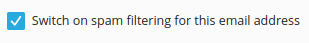

You will also have the option to decide what to do with the spam messages:

* edit the subject of the email to clearly say it’s spam;
* delete the spam messages;
* move the spam messages to a different folder.

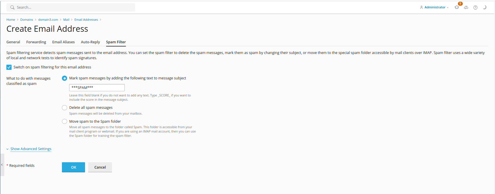

For expert requirements, you can expand the **Advanced Settings** section, and fine tune the **Spam Filter Sensitivity**. The spam filter performs a number of different tests on the content and subject line of each message. As a result, each message gets a certain score. The higher the number, the more likely a message is spam.

The filter sensitivity is set at 7 by default, so all messages that score this rate or a higher rate will be classified as spam. To make the filter more sensitive, you can adjust the Spam filter sensitivity to a lower value. If too many messages are marked as spam or junk, just set the Spam Filter Sensitivity to a higher value.

The email addresses you add on the **White List** section will not be checked by the spam filter and email addresses you add on the **Black List** will be automatically blocked.

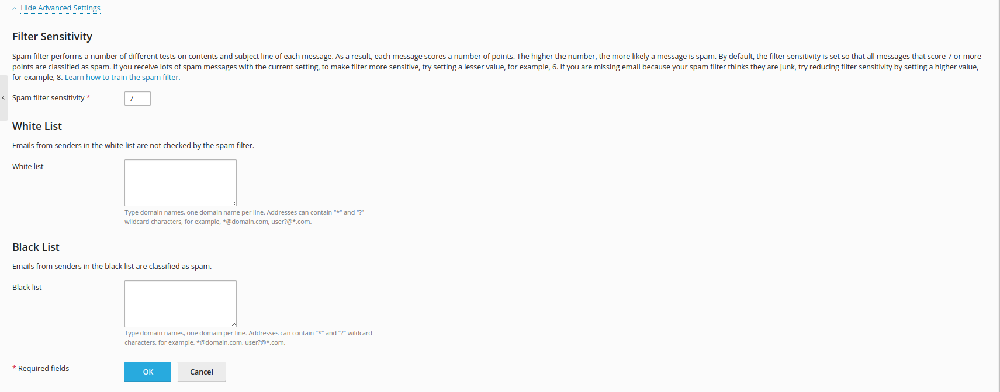

If you’re worried that Spam might still get through to your inbox or you’re not sure what the right filter sensitivity level is, don’t be ! We include **SpamAssasin** on all of our servers, free of charge. SpamAssasin is a powerful filtering system who can classify email and block spam, so you can rest assured as most of the spam messages will be stopped before reaching your Inbox.

To-Do: link the article

SpamAssasin is disabled by default, but you can add it to your server following the steps in this knowledge base article.

Now that you’ve successfully created and configured your new email account, you should learn how to use it for reading and sending emails.

### Reading and sending emails using the Roundcube Webmail
### 

Once you login to your account, just click on the Inbox tab, on the left menu. You will be able to read all the messages sent to your email address.

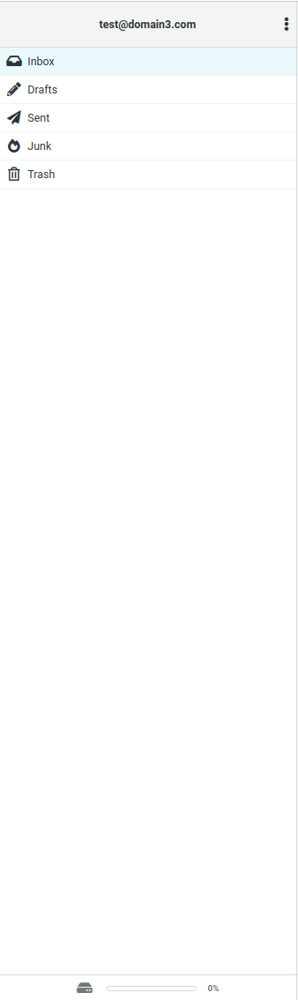

Beside the Inbox tab, you also have the **Drafts**, **Sent**, **Junk** and **Trash** folders to manage your messages.

To create a new email, just click on the **Compose** tab, right on the top on the left menu:

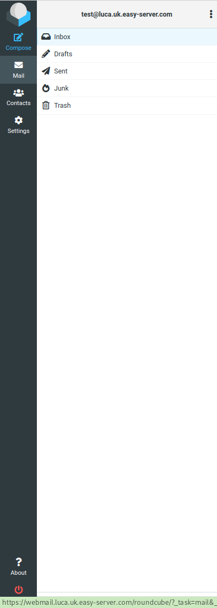

Here you also have the options of forwarding your messages, reply and reply to all, delete, mark your messages, etc.

### Reading and sending emails using Horde Webmail

To read your emails using Horde Webmail is very easy, just click on the Mail tab, once logged in to your email account.

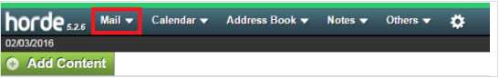
