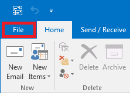
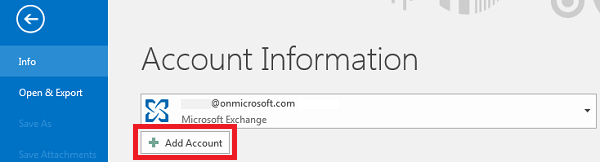
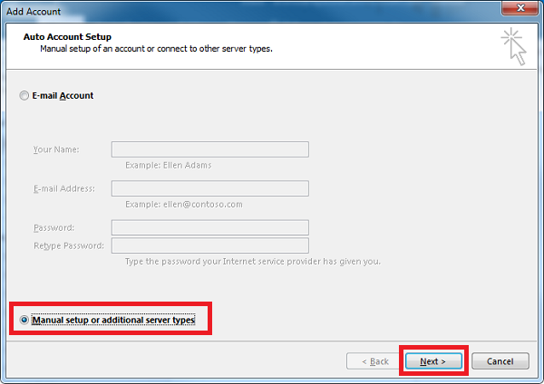
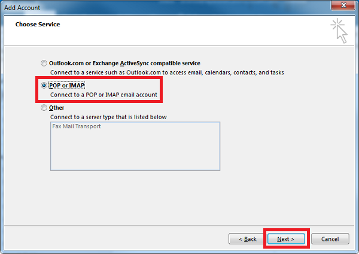
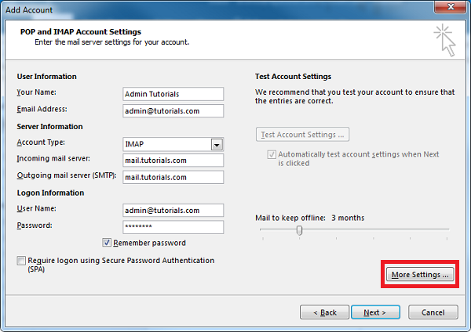
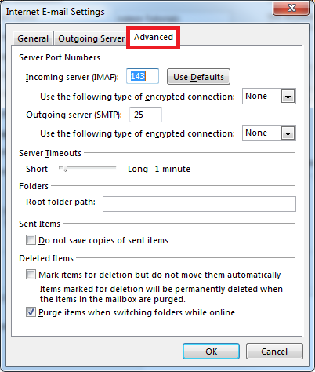
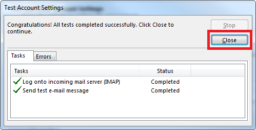
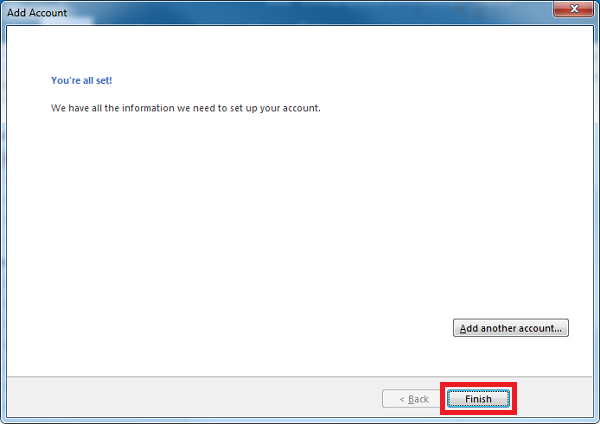

Here is a step-by-step guide to help you configure Plesk mail in Outlook.
## Step 1
Open outlook and go to ‘File’.

## Step 2
Click ‘Add Account’

## Step 3

## Step 4

## Step 5
Enter your User and Server information and click on ‘More Settings’ if you need to configure other Ports for incoming and outgoing mail server than the defaults.
If using the default ports is okay, click next and skip to <a href="#Step7">Step 7</a>.

## Step 6
Configure custom ports for Incoming and Outgoing mail servers in the ‘Advanced’ tab.

## Step 7
Wait for the account settings test to complete and click ‘Close’.

## Step 8
Click ‘Finish’ to exit the wizard and start using your email account.

