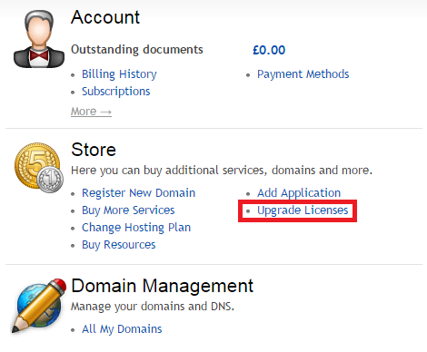
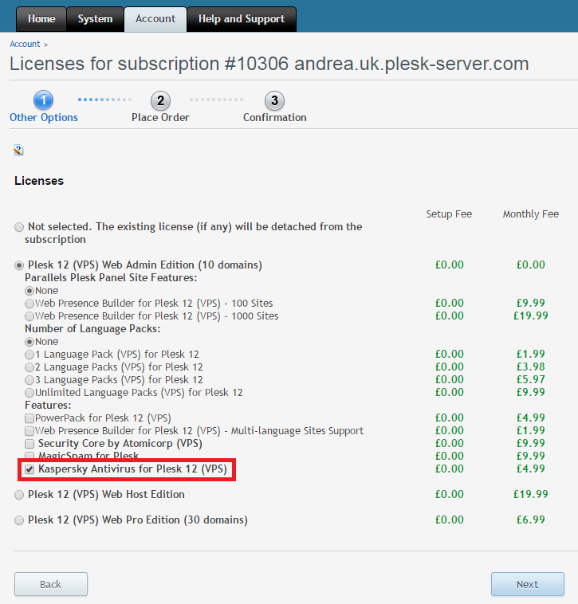

The installation and configuration of Kaspersky Email Antivirus for Plesk&nbsp;is very easy and only takes a few minutes. Kaspersky Antivirus is integrated with all versions of Plesk as an optional paid upgrade on our Cloud VPS and Cloud VPS Extreme range for only £5/month for UK subscriptions or $7.50/month for US and Singapore subscriptions. You can add it anytime to a new or existing plan.

<h2 dir="ltr">Add it to your Plesk Panel:</h2>
<ol>
<li>First, you will need to login to the&nbsp; <a href="https://control.layershift.com/" target="_blank">Layershift Customer Control Panel</a></li>

<li>If you have multiple subscriptions, you can switch between them from the drop down menu located in the right upper corner of the screen. If you have just one subscription, simply go to the ‘Home’ tab</li>
<li>Under the ‘Store’ section, click ‘Upgrade Licenses’</li>
</ol>

&nbsp;&nbsp;&nbsp;&nbsp;&nbsp; 4. Select the Kaspersky Antivirus for Plesk 12 (VPS) license and follow the wizard to place the order and submit the payment.

You’ll now be able to use Kaspersky Antivirus for Plesk to protect your e-mail.

The installation process of Kaspersky Antivirus for Plesk 12 will be performed by our Support Team, please&nbsp;<a href="http://help.layershift.com">open a support request</a>&nbsp;once you have purchased the license.

