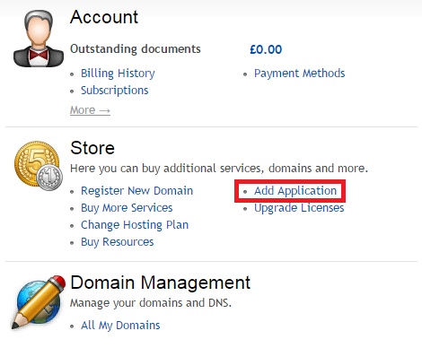
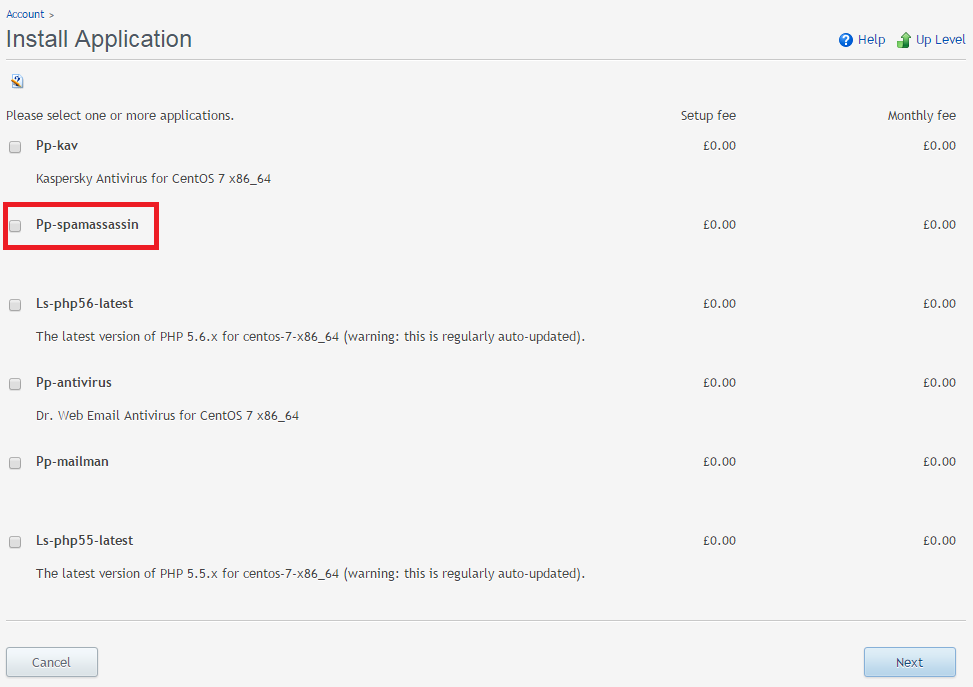

In order to use SpamAssassin, which is included free as part of your Plesk Panel license, it is necessary to install it via the Layershift Customer Control Panel. We do not install this automatically as it uses system resources (memory in particular) even when not in use. You can install SpamAssassin at any time by following the steps below:

1. Log in to <a title="Layershift Customer Control Panel" href="https://control.layershift.com" target="_blank">Layershift Customer Control Panel</a>.

2. If you have multiple subscriptions, you can switch between them from the drop down menu located in the right upper corner of the screen. If you have just one subscription, simply go to the ‘Home’ tab.

3. Under the ‘Store’ section, click ‘Add Application’:

4. Select SpamAssassin (the naming varies depending on the version of Plesk you are running, but will always contain ‘spamassassin’ in the name):

5. Click ‘next’ and follow the wizard for the application to be installed automatically.

It can take up to 15 minutes for your application to be installed, and then it should be available within your Plesk Control Panel interface &gt; Server &gt; ‘Tools and Settings’ tab &gt; Mail &gt; ‘Spam Filter Settings’ menu.

