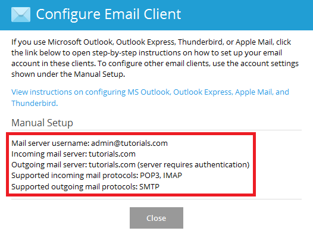

To see how to configure your Layershift hosted mail account on your specific device, please see the following links:

*     [How to configure Plesk mail in Mac](/cloud-vps/email/how-to-configure-plesk-mail-in-mac)
*     [How to configure Plesk mail in Outlook](/cloud-vps/email/how-to-configure-plesk-mail-in-outlook)
*     [How to configure Plesk mail in iOS](/cloud-vps/email/how-to-configure-plesk-mail-in-ios)
*     [How to configure Plesk mail in Android](/cloud-vps/email/how-to-configure-plesk-mail-in-android)

If you would like to configure Plesk mail in a different device or mail client, please check the general configuration settings below.

## Find the mail server information in Plesk

When configuring mail settings, please make sure to enter your mail server name correctly. You can find this in your Plesk Panel by following these steps:

1.     Log in to your Plesk Control Panel.
2.     Go to the ‘Mail’ tab.
3.     Click on the Information icon How to configure Plesk mail Information next to your email address.
4.     Your incoming and outgoing mail server names will be displayed here.

## Incoming mail settings

When you configure email for incoming mail settings, you can choose between IMAP and POP3 protocols.

The protocol you choose defines how your email client handles synchronization with your mail server

### POP3

With POP3 (Post Office Protocol version 3), your emails are downloaded on your device and erased from your mail server after the download is complete. This protocol is recommended if you would like to save disk space on your server and if you also want offline access to your emails on your device.

The default ports for POP3 are **Port 110** for a non-encrypted connection and **Port 995** if you would like to configure a secure connection.

### IMAP

Using IMAP (Internet Message Access Protocol), your emails are downloaded on your device, but the emails are also retained on your mail server. The actions performed on your device are synchronized with your server. This protocol is appropriate for you if you use multiple devices to read your emails as they are synchronized and you can download all emails on all devices.

You will need to use **Port 143** for a non-encrypted connection, or you can use **Port 993** for secure connection.

Plesk, by default, uses a self-signed certificate for mail server, therefore, you may be presented with certificate warning notification while setting up connection in your mail client. Don’t worry though, your connection will still be valid and secure! You can also set up a secure connection with a custom certificate. For more details and pricing contact our SSL department.

## Outgoing mail settings

SMTP (Simple Mail Transfer Protocol) is used for sending emails.

The default non-secure ports are **Port 25** and **Port 587**, while **Port 465** is used for secure SMTP.

We recommend using the secure port either with the certificate provided by Plesk or your custom SSL certificate.