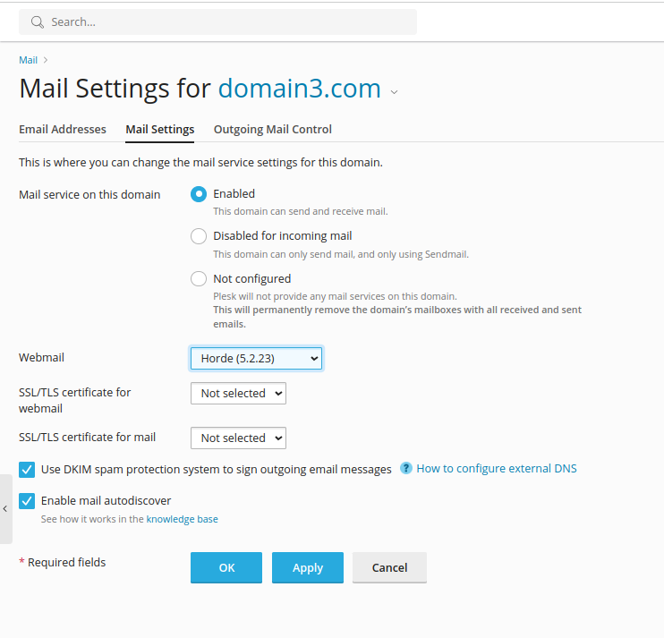

## How do I change webmail client?

### Roundcube

To use Roundcube, simply login to **Plesk Dashboard**, select **Domains** and choose the desired domain, click on the **Mail Settings** tab, and select **Roundcube** as webmail client from the drop-down box. This can be changed easily at any time and will be activated usually within just a few seconds.

### Horde

For Horde, simply login to **Plesk Dashboard**, select **Domains** and choose the desired domain, click on the **Mail Settings** tab, and select **Horde** as webmail client from the drop-down box. This can be changed easily at any time and will be activated usually within just a few seconds.

