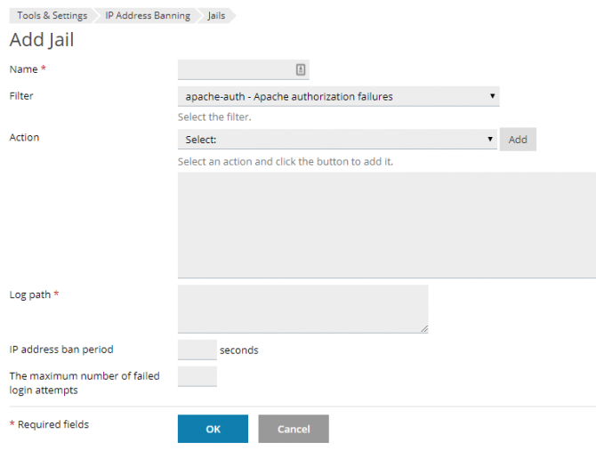

Your Cloud VPS incorporates two firewall systems to keep your server safe:
1. iptables - a stateful packet filtering firewall
2. fail2ban - transforms iptables into an active firewall, capable of dynamically blocking malicious traffic in real time

Although we preconfigure both firewall systems with sensible "defaults", every customer is slightly different so it's important to optimise the firewall rules to fully meet your specific needs. Both are controlled via Plesk, so are very easy to customise.

# iptables

The firewall is managed via Plesk under Tools & Settings > Security > Firewall.

!!! Simply type *Firewall* into the search bar at the top of any page of the Plesk panel to quickly navigate to the firewall rules management screen

On that screen you will see a read-only representation of the current rules. Click the *Modify Plesk Firewall Rules* button to enter 'edit mode', make the desired change, and then *Apply Changes* to make the new rules live.

Please see [Plesk documentation](https://docs.plesk.com/en-US/obsidian/administrator-guide/plesk-administration/the-plesk-firewall-linux.72046/) for more detailed guidance.

# fail2ban

Fail2Ban is an active firewall that dynamically blocks traffic by source IP address in response to suspected malicious activity.

It works by identifying patterns within your server log files, for example corresponding to repeated login failures or other forms of suspicious activity. Once an attack is identified the offending IP is blocked by the firewall; first temporarily and then, if repeated, permanently.

**Brute force attacks** try to get access to your server (email account, WordPress admin, SSH etc.) by guessing your password: trying multiple random or [well known passwords](https://haveibeenpwned.com/Passwords) in the hope they’ll stumble into the correct answer.

Repeated failed login attempts for WordPress, Plesk Panel, Email or other services will be treated by Fail2Ban as a suspected brute force attack.

Fail2Ban is particularly powerful compared to just *iptables* by itself because:
* it's reactive to unknown threats: you don’t know which source IP addresses are malicious in advance
* it can be deployed in places where the trusted source IP addresses cannot be defined: you don’t know who will visit your website, or from which IP address, in advance, so you need to keep it open and accessible to the entire world – only blocking out those who prove themselves untrustworthy.

! Fail2ban blocks typically apply to all ports, so malicious activity detected in one place (e.g. mail server) may block access to everything else on the server (Plesk, websites, FTP etc.)

## Managing fail2ban

Fail2ban is managed via Plesk under Tools & Settings > Security > IP Address Banning (Fail2Ban)

!!! Simply type *fail2ban* into the search bar at the top of any page of the Plesk panel to quickly navigate to the IP Address Banning screen

The interface is split into tabs for managing and reviewing different aspects of fail2ban's operations.

### Banned IP Addresses

This lists IP addresses that are **currently blocked**, and allows you to individually unblock them (*Unban*), or select IPs that should be considered as safe / non-malicious (*Move to Trusted IPs*).

You can [find the IP address of your current connection using an online lookup tool](https://info.layershift.com/). 

If you can’t access your server because you suspect that your IP is banned by fail2ban:
* Try to connect from a different IP address (e.g. via mobile phone network or a VPN)
* Contact support for assistance, including your current IP address, symptoms experienced (e.g. the URL you cannot access), and your most recent invoice number as proof that you're the account holder

!!! If an IP address is exhibiting malicious behaviour (e.g. repeated failed login attempts), ‘Unban’ will only provide a temporary fix until it is banned again. In such cases it’s advisable to identify and solve the root cause by inspecting the logs.

### Trusted IP Addresses

IP addresses listed here using the *Add Trusted IP* button will never be blocked by fail2ban. As well as individual IPs, you can also add IP ranges in CIDR format such as 192.0.2.0/24.

!! Only add static IP addresses as 'trusted' - please contact your ISP to obtain a static IP address for your connection if your IP address changes each time you reconnect to the internet.

### Jails

A fail2Ban *jail* is a combination of a *filter* and one or more *actions*.  Fail2ban uses (python) regex expressions (*filters*) to match a pattern in a log file; for example, a failed login attempt. When a *filter* matches a specified number of times, the *jail* performs the configured action(s) - namely blocking the IP address in *iptables* and/or sending an email notification.

#### Filter

There are a number of predefined filters to choose from already defined in Plesk, but here's how to create your own filter to secure your own custom application, under *Manage Filters*:

* Review your logs to find sample entries corresponding to the malicious action that you want fail2ban to detect
* Write a (python) regular expression to match that entry

!! The filter expression must contain a `<HOST>` placeholder for the user's IP address that you wish to block

!!! Refer to [the fail2ban manual](http://www.fail2ban.org/wiki/index.php/MANUAL_0_8#Filters) for further details

#### Defining a custom Jail

Once you have the filter that you wish to use (predefined or custom), you can *Add Jail* to use it, selecting as many actions as you wish, and one or more log files to inspect.

! The full path must be used for each log file. Web server logs for each domain are typically under `/var/www/vhosts/domain.com/logs`

### Logs

The logs tab simply provides access to the fail2ban log where you can see which filters/jails were matched, and any un/ban actions performed in response.

!!!! This log is particularly useful to see why a particular IP was banned

### Settings

The settings tab allows you to turn fail2ban on/off (*enable intrustion detection*) and set some global settings that apply for all *jails*.

! Some actions may create entries in multiple logs monitored by fail2ban, activating multiple jails for one incident. Hence fail2ban would consider that as multiple failures, and you should configure the failure count with that point in mind.
