Here is a step-by-step guide to help you configure Plesk mail in Android.

### Step 1

Open the Gmail app, go to `Settings` and tap **Add account**:

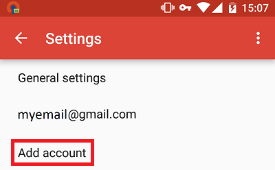

### Step 2

Select `Personal (IMAP/POP)`:

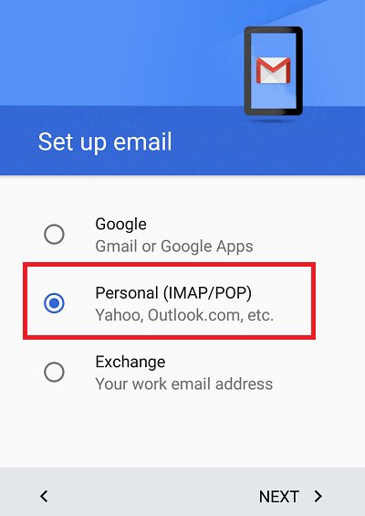

### Step 3

Insert email address and select `Manual setup`:

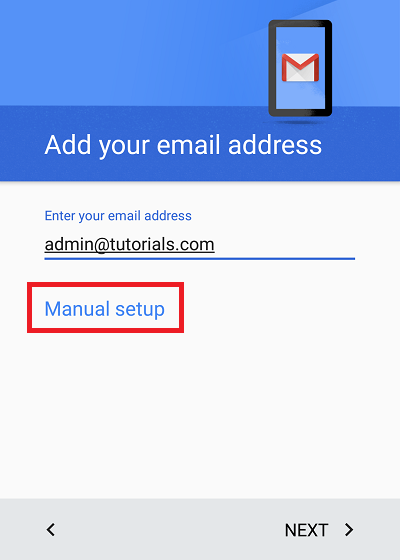

### Step 4

Select **Personal (IMAP)** or **Personal (POP3)** according to your preference. To learn more about the difference, please see our article about [setting up mail accounts](../how-to-configure-plesk-mail#incoming-mail-settings).

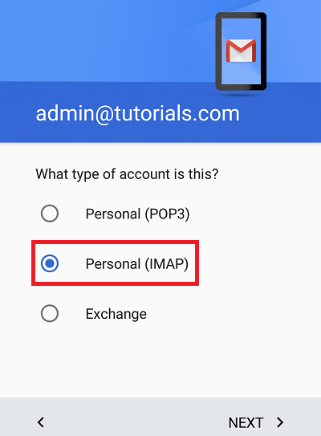

### Step 5

Enter your password:

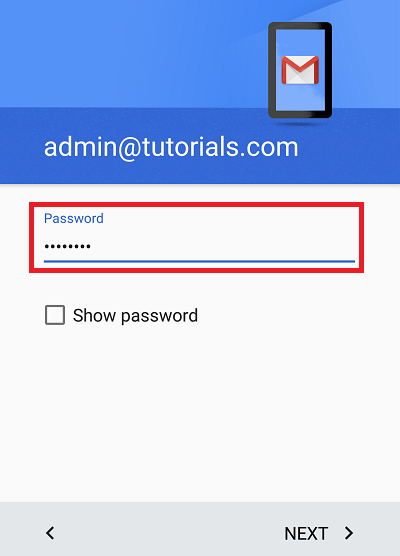

### Step 6

On the incoming settings screen select authentication `SSL/TLS (Accept all certificates)`:

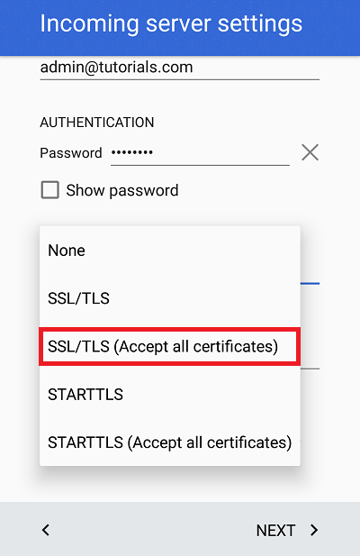

### Step 7

The incoming server settings will be validated:

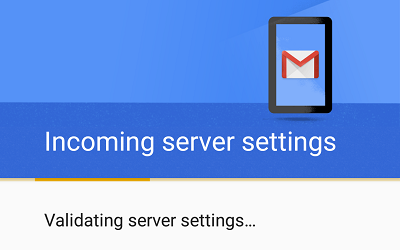

### Step 8

On the outgoing server settings screen select authentication `SSL/TLS (Accept all certificates)`:

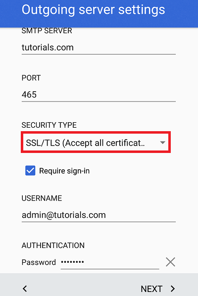

### Step 9

Select the prefered synchronization options.

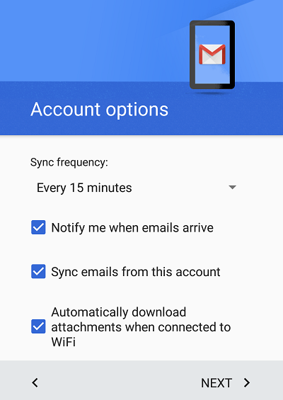
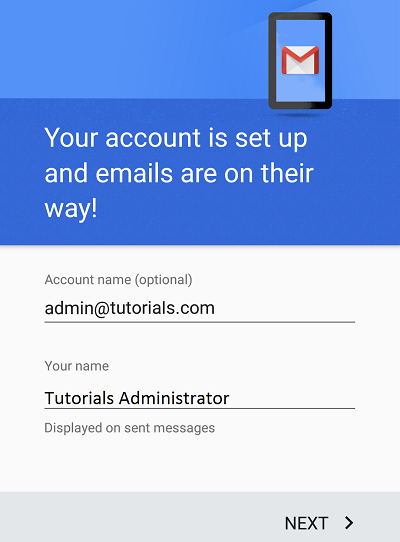

### Step 10

Tap your `Inbox` to start reading and writing emails.

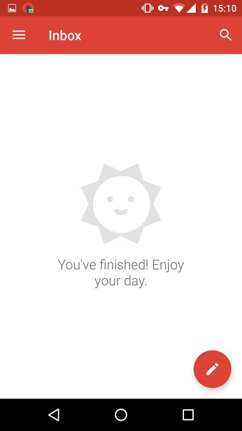

