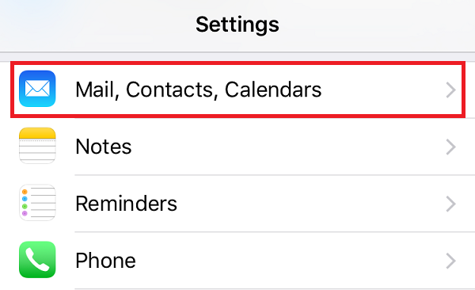

Here is a step-by-step guide to help you configure Plesk mail in iOS.
## Step 1
Go to Settings and tap ‘Mail, Contact, Calendars’.

## Step 2
Select ‘Add account’.

## Step 3
Select ‘Other’ from the list of email providers.

## Step 4
Then tap ‘Add Mail Account’.

## Step 5
Enter your Name, Email, Password and a short description and tap ‘Next’.

## Step 6

To discover incoming and outgoing mail server settings for you account, please visit [this site](https://info.layershift.com/mail/) and use your email address as a parameter.
## Step 7
Select IMAP or POP and enter your incoming and outgoing mail server details.
If you have doubts on whether POP3 or IMAP suits you best, see our article about [general settings](/cloud-vps/email/how-to-configure-plesk-mail#incoming-mail-settings).

## Step 8
If you receive a SSL Certificate warning please open a support ticket at [help.layershift.com](https://help.layershift.com/) in order to investigate the mail server setup.

## Step 9
Tap ‘Save’ to finish setting up your email.

