Here is a step-by-step guide to help you configure Plesk mail in Mac.

### Step 1

Open Mail, either from **Dock**:

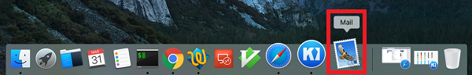

or from **Spotlight** (CMD+Space):

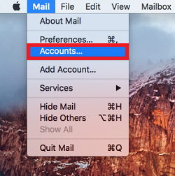

### Step 2

On the Finder bar, click ‘Mail’ and select `Accounts`.

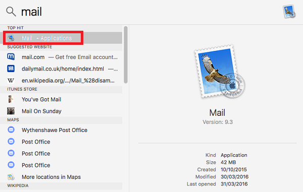

### Step 3

Expand `Add Other Account`:

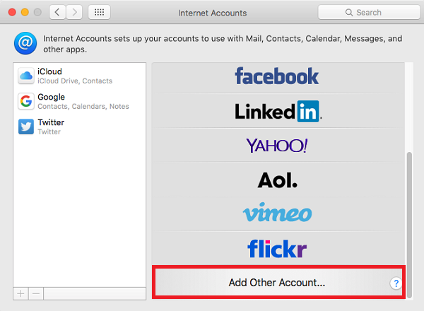

### Step 4

Select `Mail account`:

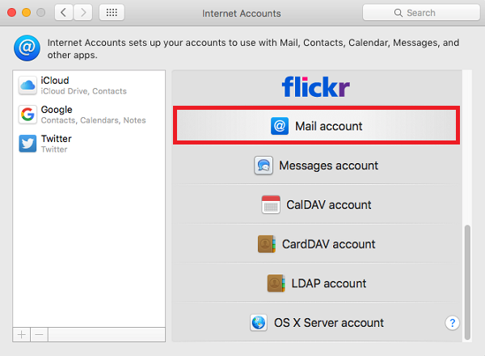

### Step 5

Provide your email login details:
    
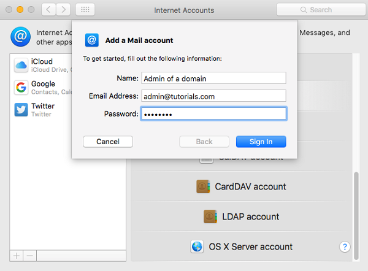

### Step 6

To discover incoming and outgoing mail server settings for you account, please visit [this site](https://info.layershift.com/mail/) and use your email address as a parameter.

### Step 7

Select the account type (**POP** or **IMAP**) and enter the incoming and outgoing mail server names.
If you have doubts on whether POP3 or IMAP suits you best, see our article about [general settings](../how-to-configure-plesk-mail#incoming-mail-settings).

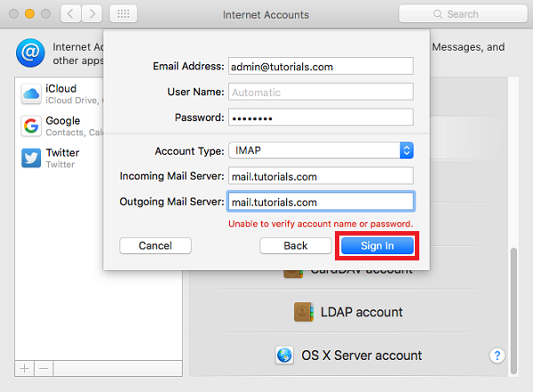

### Step 8

If you receive a SSL Certificate warning please open a support ticket at [help.layershift.com](https://help.layershift.com) in order to investigate the mail server setup:

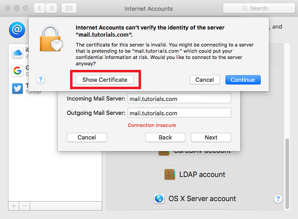

### Step 9

To accept the certificate permanently tick ‘Always trust’ and hit ‘Continue’.

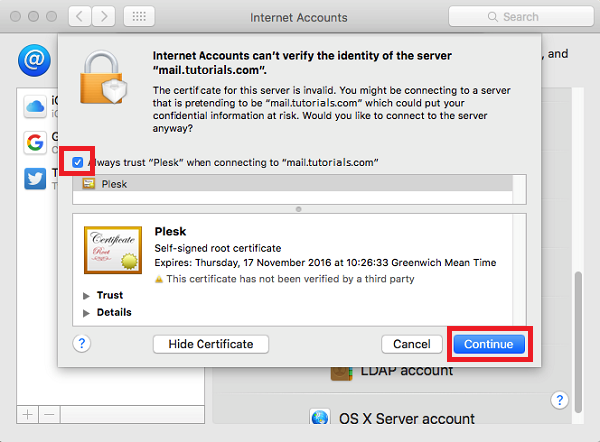

### Step 10

To set up **SMTP** (outgoing mail) select to ‘Preferences’ from the ‘Mail’ menu.

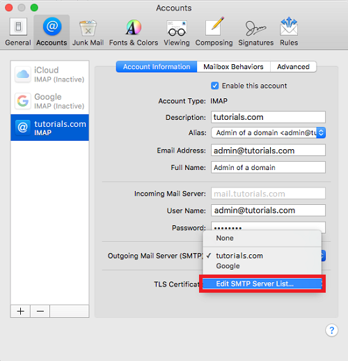

### Step 11

Expand **SMTP** and choose `Edit SMTP Server List` from the drop down menu:

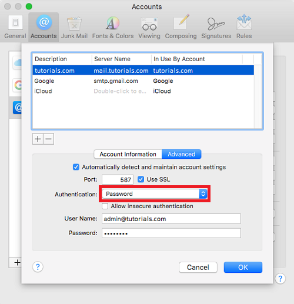

### Step 12

Go to the `Advanced` tab, set Authentication to **Password** and enter your login details.
    

