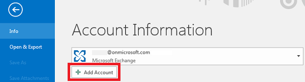
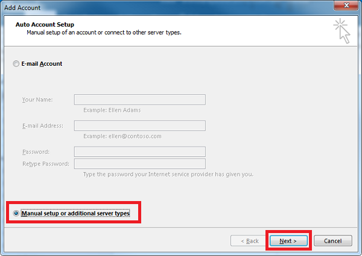
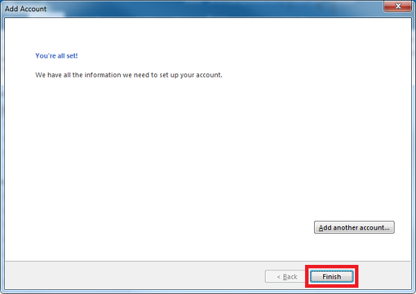

Here is a step-by-step guide to help you configure Plesk mail in Outlook.

### Step 1

Open outlook and go to `File`:

### Step 2

Click `Add Account`:

### Step 3

### Step 4

### Step 5

Enter your User and Server information and click on `More Settings` if you need to configure other Ports for incoming and outgoing mail server than the defaults.
If using the default ports is okay, click next and skip to <a href="#Step7">Step 7</a>.

### Step 6

Configure custom ports for Incoming and Outgoing mail servers in the `Advanced` tab:

### Step 7

Wait for the account settings test to complete and click `Close`:

### Step 8

Click ‘Finish’ to exit the wizard and start using your email account:

