**Why do I need to see the full email headers ?**

Being able to see the full email headers (or the internet headers as some people call them) can be very helpful in troubleshooting common delivery issues, finding the reasons behind a bounced message or even identifying spam emails from real ones. The information displayed by default by the email header is the sender and recipient email addresses and the time stamp showing when the email was received, but this is not all that a header contains. Most email clients don’t reveal the full headers, so things like the return path of the email or the SPF record are hidden. Knowing how to manually find these details can help our support team in identifying and solving your email problem quicker.

You’ll be able to see step by step instructions on how to check the full headers for the most common used mail clients below:
    
[Outlook](#outlook)

[Outlook.com](#outlook.com)

[Apple Mail](#apple-mail)

[Horde](#horde)

[Roundcube](#roundcube)

[Yahoo](#yahoo)

[Gmail/Google Apps](#gmail-google-apps)

### Outlook

**1.** Go to your inbox and select the email you wish to check 

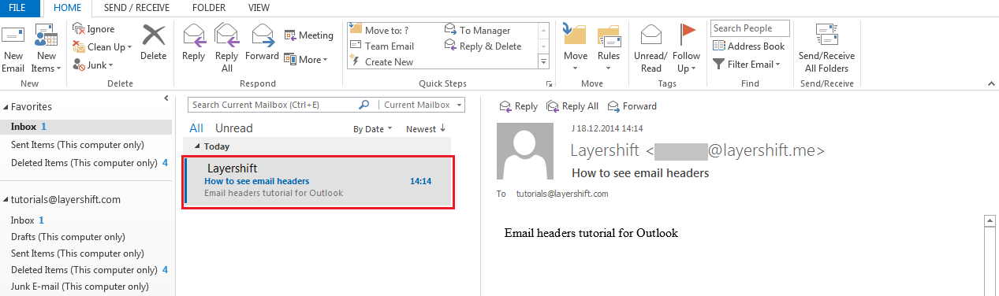

**2.** Double click to open it on a separate window

**3.** Click on the small expand button next to Tags, which will make the “Message options” section available

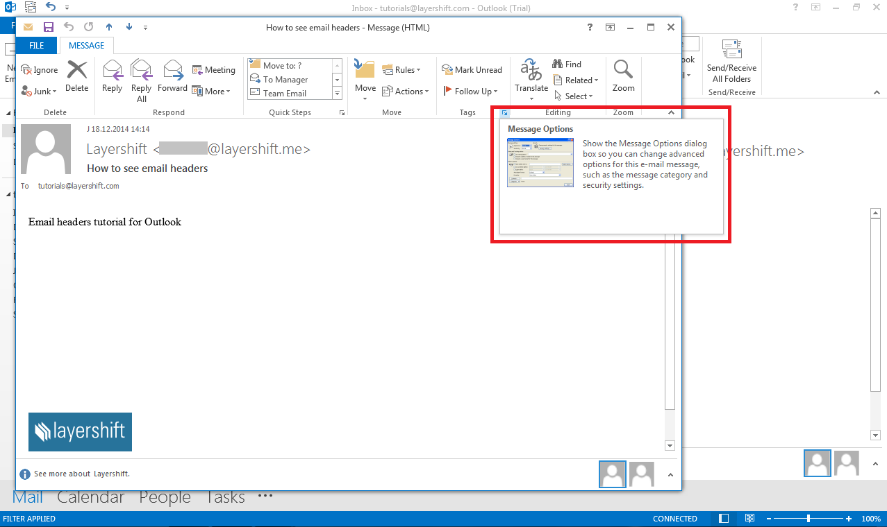

**4.** A new pop up window will open, which will contain the full headers of the email you just received. 

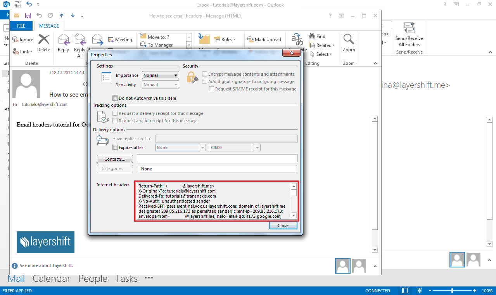

### Outlook.com

**1.** Sign in to your Outlook.com account

**2.**     Select an email to see the message content

**3.** Click on the “…” icon next to Categories to see the More Commands Section 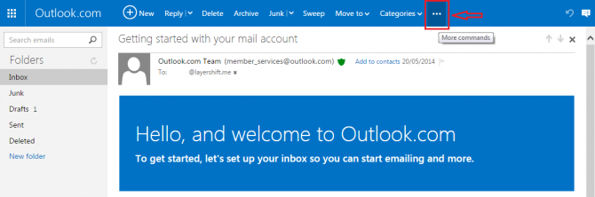

**4.** From the drop-down menu select “View message source” 

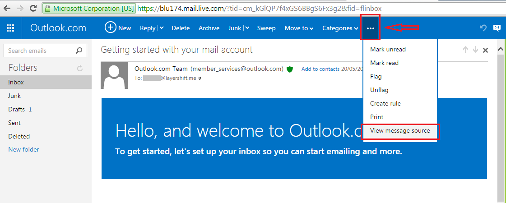

**5.** A new tab containing the mail headers will open in your browser 

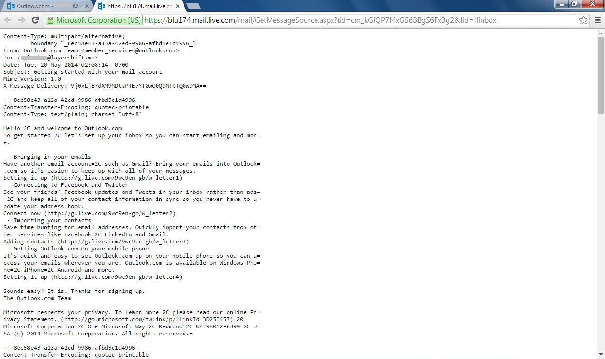 

### Apple Mail

**1.** Open your inbox and click on the email 

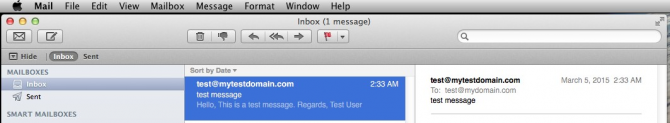

**2.** Click on View > Message > All Headers 

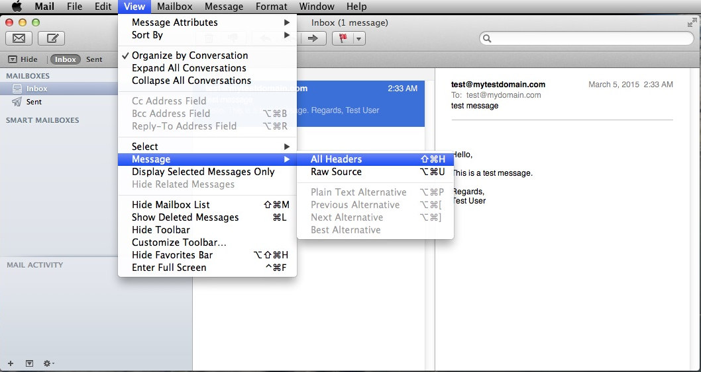

**3.** The full headers of the email will be displayed in the right side of the screen 

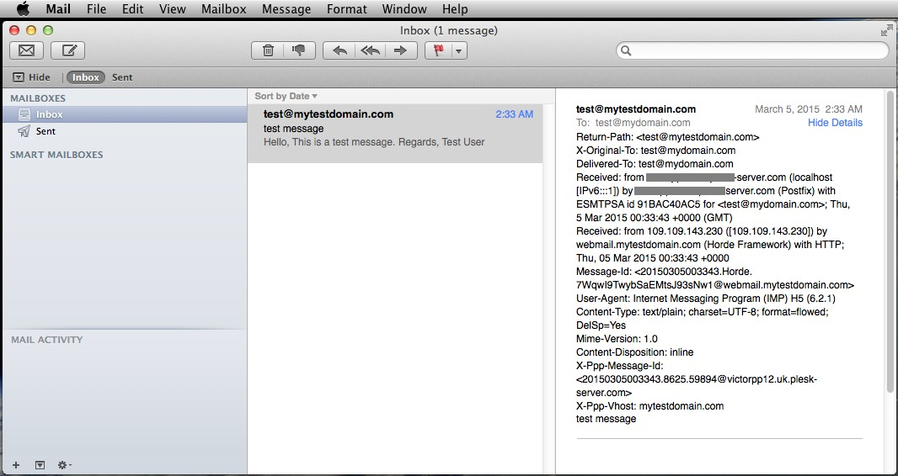 

### Horde

**1.** Open the Horde webmail and select the email you wish to check.

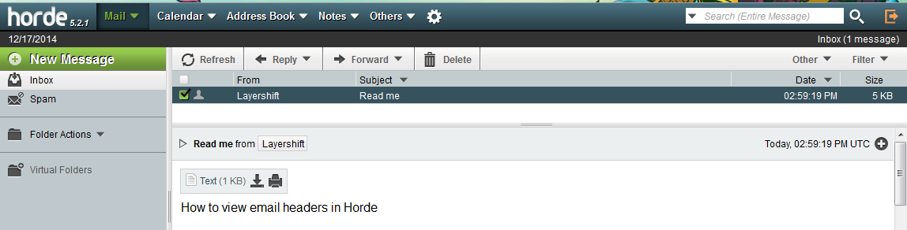

**2.** Click on the “+” icon (Other Options) > View Source 

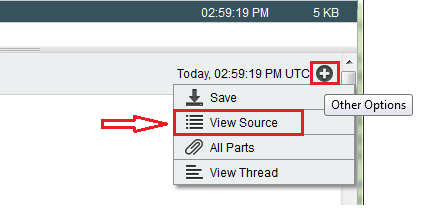

**3.** A new window containing the full headers of this email message will open 

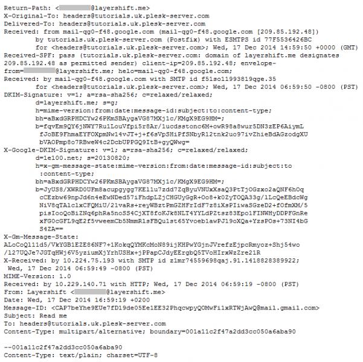

### Roundcube

**1.** Login to your Roundcube webmail

**2.** Select the email you wish to check the full headers for 

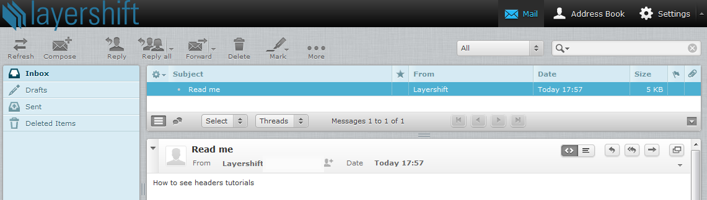

**3.** Click the small arrow in the screenshot below to see full headers 

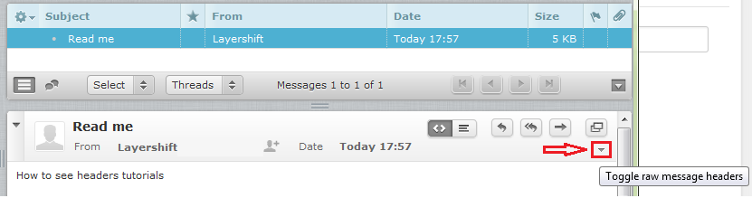

**4.** The ‘sender’ area will be expanded to include the required details 

 

### Yahoo

**1.** Login to your Yahoo! account

**2.** Click on an email to open it 

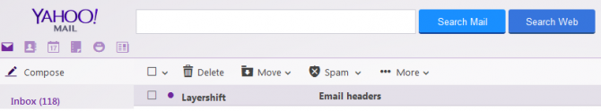

3. Go to “More” and select “View Full Header”
 
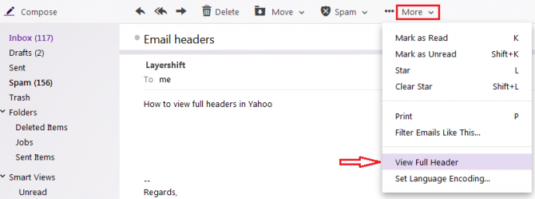

**4.** The Full Header of the email will be opened in a new pop-up box 

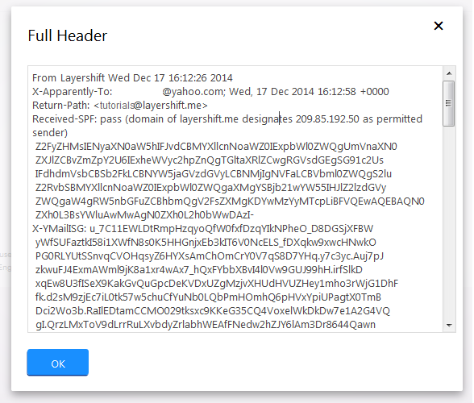 

### Gmail/Google Apps

**1.** Sign in to your Gmail / Google Apps account

**2.** Open the email you wish to check 

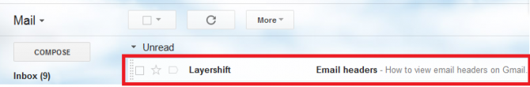

**3.** From the “More” icon (next to Reply) select the “Show original” option

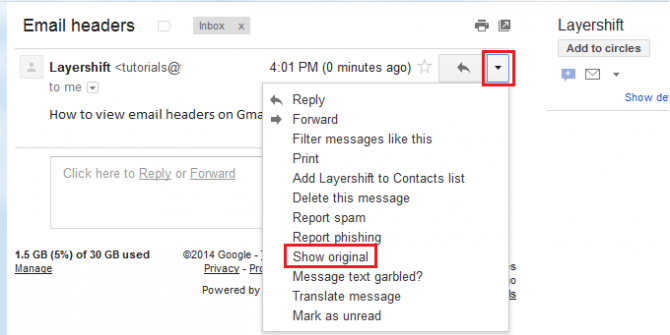

**4.** A new tab / window with the original message, including full headers will be opened

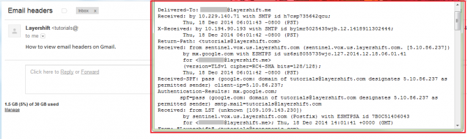 

