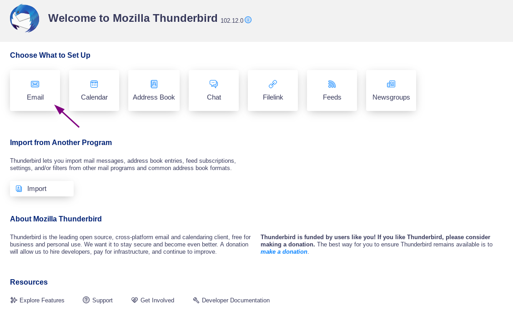
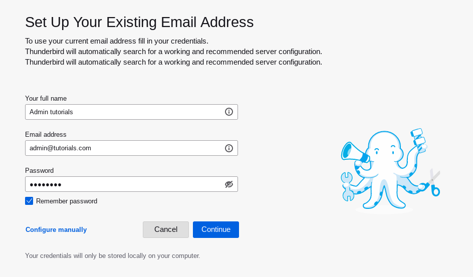
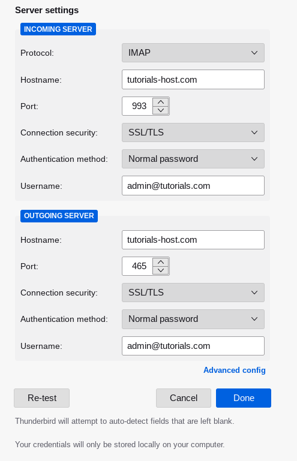
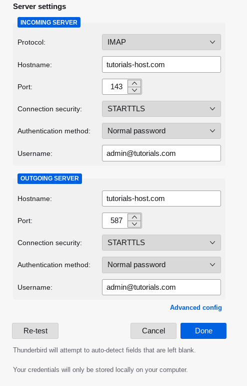

Here is a step-by-step guide to help you configure Plesk mail in Thunderbird.

### Step 1

Open Thunderbird and select to set up an email:

### Step 2

Enter your name, as you want it to appear in any messages you send, email address and password:

### Step 3

In the manual configuration, adjust the incoming and outgoing Hostname to match your Plesk VPS hostname. The Ports and Connection security should either use `STARTTLS` or `SSL/TSL` (with associated ports seen in example pictures): 

Alternate port and Connection security option:

Once set, click `Re-test`:

### Step 4

If the Re-test was successful, you can click Done to finish setting up your email.