# Website staging with Plesk Obsidian  

All good developers know it’s important to test your code before publishing it to live, and the easiest way to do this is using a website staging environment. This allows you to ensure your code is stable and tested, to prevent unwanted outages due to glitches which can affect your users and cost your business money.  Plesk Panel allows you to setup a website staging environment to check that everything runs smoothly before pushing your code into production.  

### The action plan  

Before proceeding with this you should decide where you want to host the staging environment. You have three options: use the same webspace, create a new one or upload it to an FTP account on another server.  

#### 1. Host it in your current webspace  

If you decide to host the staging website in the same webspace you will need to first create a new domain or a subdomain. We will quickly guide you through these steps.  

##### Creating a new domain  

To add a new domain to your existing webspace simply go to `Websites & Domains` and select `Add Domain`:  

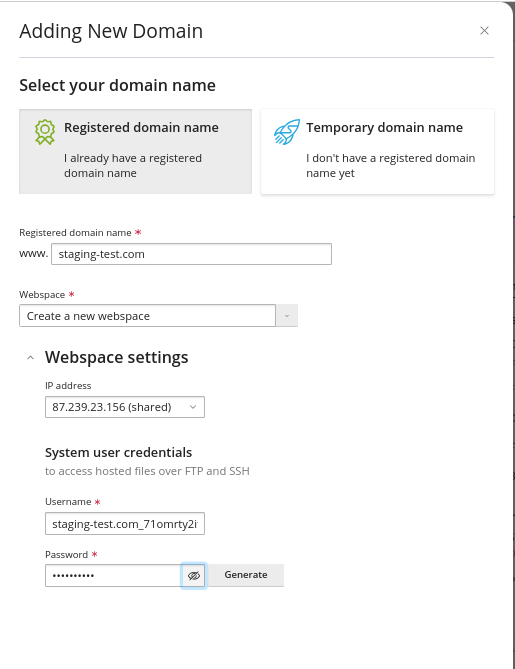

Next, as a way of creating the website, click on `Blank website` and then select which domain name you wish to use, choose the correct webspace in case there are multiple ones and set up hosting type and settings depending on your needs.

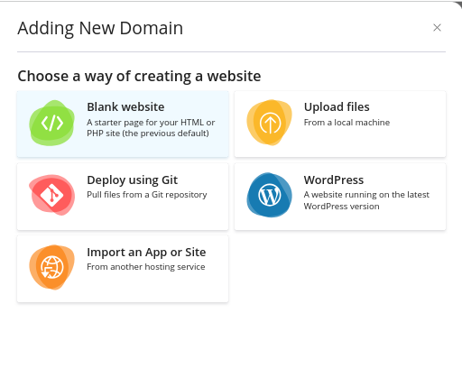

##### Creating a subdomain

If you already possess a domain, it's a straightforward process to add a new subdomain to it and employ it for testing purposes (e.g., staging.yourdomainname.com or something similar). To create this new subdomain, access the Websites & Domains section and choose the option to Add Subdomain.

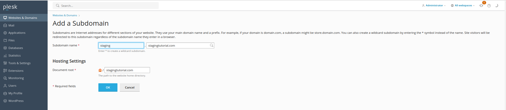

Once arrived at this step, make sure that the **Parent domain** filed is set on the desired domain and set the desired subdomain name.

#### 2. Use a separate webspace on the same server

Go to `Websites & Domains` and select `Add Domain`:

 

Enter the name of your domain and opt for creating a new webspace. You may choose an IP address to host the domain (though it's not mandatory, as you can safely use the same IP). Provide your preferred login credentials (or stick with the automatically generated ones), which will grant you FTP and SSH access.

### Copy the website

Now that you’ve decided on the location of your staging environment and configured it, the next step involves copying everything from the production environment to the staging environment. This can be achieved by following the subsequent steps:

#### How to copy your website's files?

1. Go to the **Websites & Domains**, find the website you want to copy, then select **Website Copying**.

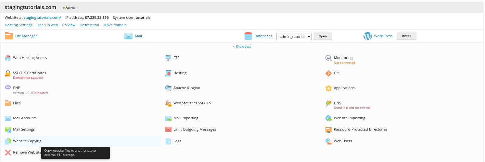

2. Select the file destination option:

   * Website in Plesk:
	
	Choose the target domain for the copy from the provided list of site names in the dropdown menu. You have the option to retain or delete any pre-existing files on the destination server before the copy process. However, it's essential to be aware that if there are any files with identical names on the destination server, they will always be replaced during the copying process.
	
    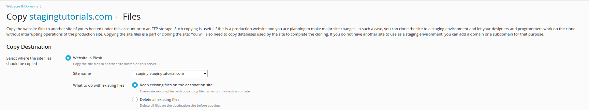
    
   * On another server, using the FTP storage option. 
   
   In this case, you need to specify the server’s host name and credentials for connecting to the external FTP account.
   
   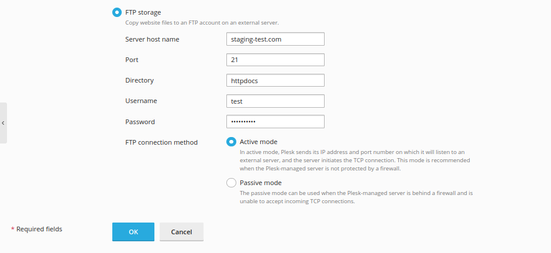
		
   Use the Active mode option in the FTP connection method field. If you can’t manage to connect to the external FTP account, try again with the Passive mode enabled.

#### Don't forget about your databases!

If your website relies on a database, it's necessary to copy it to the staging environment. To accomplish this, please follow the provided instructions:

* Select `Databases` from the left main menu:

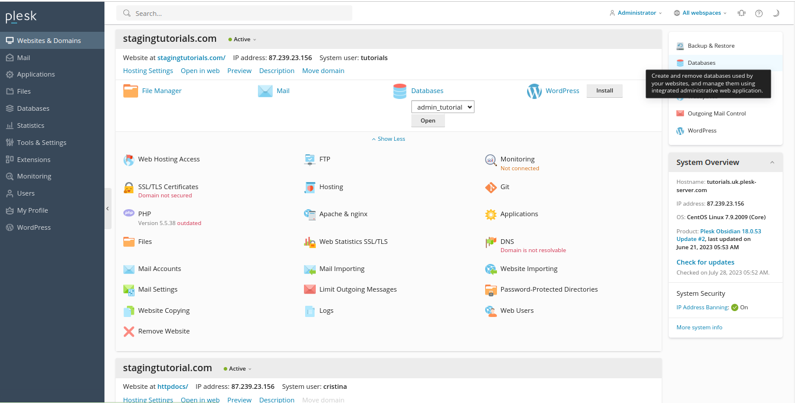

* Choose the Webspace where your website is hosted:

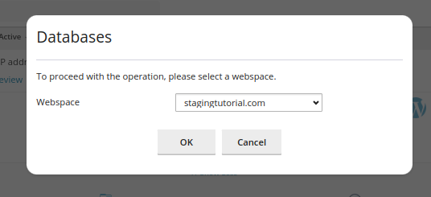

* Find the database(s) you need to copy and click the `Copy` icon:

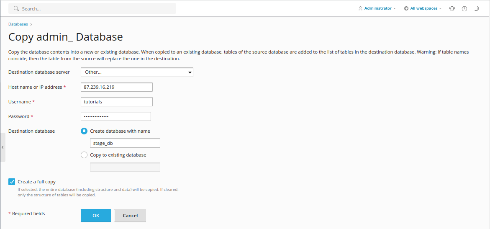

* Next, you’ll need to choose the destination of the database copy

	 * If your want to copy the database to a new or existing database on the same server, select the destination server, Webspace and enter a new database name or select from existing 		databases:

	**Additional Note** : We recommend you use the “create a full copy box” if you want the full database copied, or deselecting this option if you only want the database structure to be copied (such as if you are planning to populate the database with test data).
    
	

	* If you want to publish the database to a separate server, you will need to specify the host name (or IP address) of the remote server to create the new database or overwrite an existing database.
    
* Once you click the `Ok` button, the database copying process will start immediately.

* Once the copy has completed, you should modify your site’s scripts in the website staging environment so they connect to the copied database, such as by modifying connection strings to connect to a new database name, username and password.

### From website staging to production

When the site copy in the staging environment is updated and ready to go live, you can publish it:

* Access `Plesk Dashboard` and click on `Website & Domains` tab:

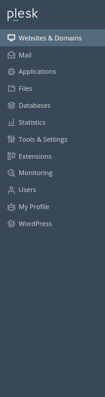

* Locate the address of your production site in the list of domains, access `Hosting Settings` and update the document root directory with the one of the staging site:

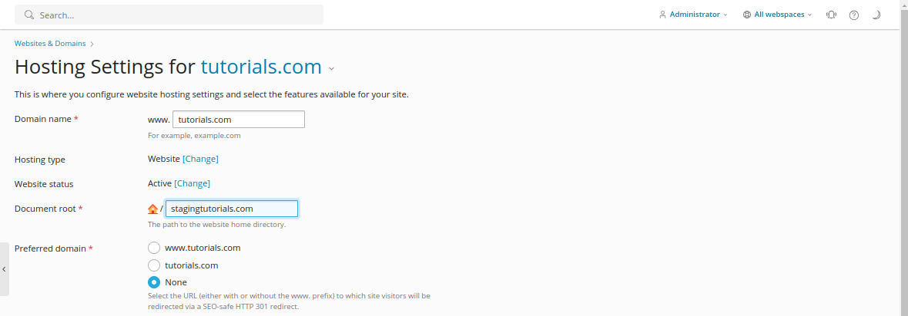

All the modifications you have implemented on the site are now accessible and visible to external users.

 
