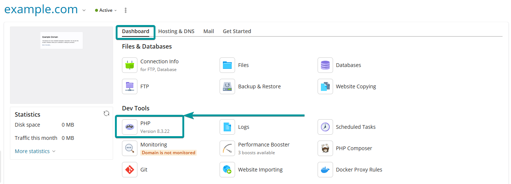

In Plesk, you have the flexibility to easily modify PHP handler without experiencing any server or domain downtime. This feature can be particularly advantageous for enhancing website performance or switching to your preferred PHP handler, if you have one in mind! When PHP operates, it creates new files and writes to existing ones using the user it runs as.

## Available handlers

* 	FPM (FastCGI Process Manager) - Best performance, recommended for most sites.
* 	FastCGI - Most commonly used, reliable, and generally good performance. (required when using LiteSpeed)
* 	CGI -Older method, slower, only use if required.

Below are step-by-step instructions guiding you on how to change the PHP handler directly from within the Plesk Dashboard:

### FastCGI application served by Apache
* The default option on many servers
* Stable, secure, and widely compatible
* Starts a new PHP process for each request (less efficient)

### FPM application served by Apache
* Faster than FastCGI due to persistent parent-PHP processes
* Nginx proxies the PHP requests to Apache
* Ideal for high-traffic sites

### FPM application served by nginx
* Same benefits as above
* NGINX handles PHP directly (faster in some setups)

### Dedicated FPM (Apache or nginx)
* One PHP process pool per domain
* Best for busy or resource-intensive domains
* Slightly more memory usage

!!!! By default, both FastCGI and FPM handlers are available and enabled on your Plesk server.

## How to change the PHP Version

