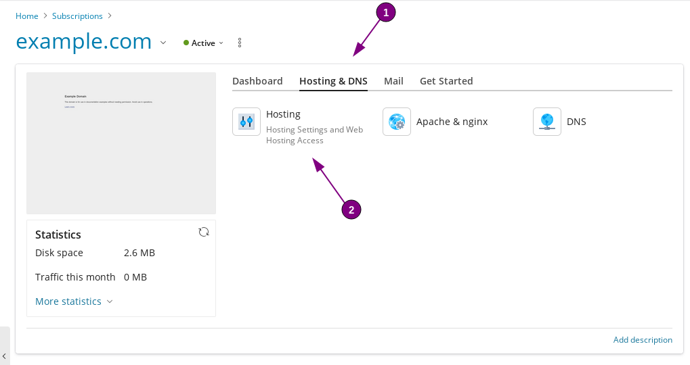
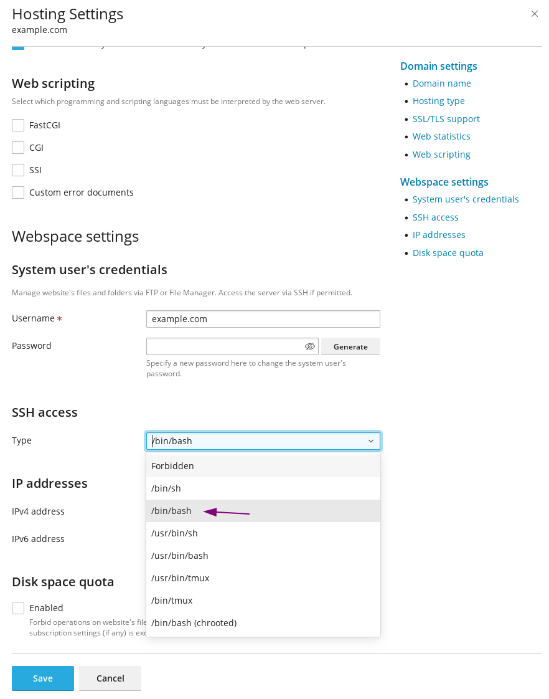
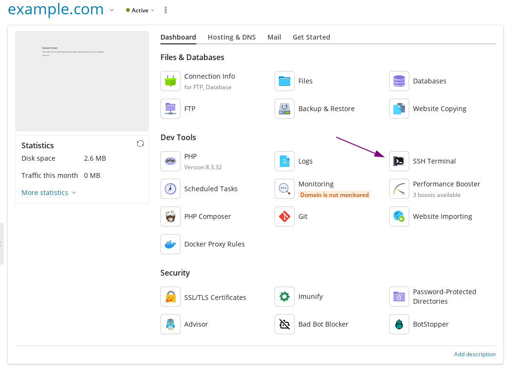

Supervisor is a process manager that manages long-running programs. To avoid configuration conflicts among the different webspaces, supervisor can be installed via the webspace user.

### Enabling SSH access
As a prerequisite, SSH access needs to be enabled.

This can be achieved by accessing the hosting & DNS settings:


and selecting `/bin/bash`:



Once enabled, we can login via SSH using the SSH Terminal button:


### Installing supervisor and adjusting configuration files

Next, we install supervisor via pip, as `--user`:
```
pip3 install --user supervisor
```

Edit `~/.profile` with your preferred editor:
```
vi ~/.profile
```

Add the following lines:
```
export PATH=~/.local/bin/:$PATH
alias supervisorctl='supervisorctl -c ~/.local/etc/supervisord.conf '
alias supervisord='supervisord -c ~/.local/etc/supervisord.conf '
```

Run the following to source the updated .profile file:
```
source .profile
```

Create a folder for the service files:
```
mkdir -p ~/.local/etc/supervisor.d
```

Generate the configuration file:
```
echo_supervisord_conf > ~/.local/etc/supervisord.conf
```

Make the following adjustments to the supervisord configuration, changing the following lines:
```
file=/tmp/supervisor.sock ; the path to the socket file
logfile=/tmp/supervisord.log ; main log file; default $CWD/supervisord.log
pidfile=/tmp/supervisord.pid ; supervisord pidfile; default supervisord.pid
serverurl=unix:///tmp/supervisor.sock ; use a unix:// URL for a unix socket
```

to point to the `.local` folder:
```
file=~/.local/supervisor.sock ; the path to the socket file
logfile=~/.local/supervisord.log ; main log file; default $CWD/supervisord.log
pidfile=~/.local/supervisord.pid ; supervisord pidfile; default supervisord.pid
serverurl=unix://~/.local/supervisor.sock ; use a unix:// URL for a unix socket
```

And in the same configuration file, uncomment (removing the leading `;`) the last two lines, and adjust the `files` variable to point to our previously created service file location:

Changing these lines:
```
;[include]
;files = relative/directory/*.ini
```

To this:
```
[include]
files = supervisor.d/*.ini
```

### Creating the supervisor scripts

Create the desired service files(s) in `~/.local/etc/supervisor.d/`. An example file `running_script.ini` contains the following:
```
[program:running_script]
command=/bin/bash ~/script.sh
autostart=true
autorestart=true
```

An alternate example file that will spawn two processes (adjustable by the `numprocs` variable):
```
[program:running_script_multiple]
command=/bin/bash ~/script.sh
numprocs=2
startsecs=0
autostart=true
autorestart=true
process_name=%(program_name)s_%(process_num)02d
```

### Creating and scheduling the Supervisor watcher script

Create the following script under `~/.local/bin/test_supervisord` that checks if supervisord is running:
```
#!/bin/bash

export PATH=~/.local/bin/:$PATH
alias supervisorctl='supervisorctl -c ~/.local/etc/supervisord.conf '
alias supervisord='supervisord -c ~/.local/etc/supervisord.conf '

supervisorctl status 2>&1 >/dev/null
if [ $? -ne 0 ]; then
supervisord
fi
```

Make it executable:
```
chmod +x ~/.local/bin/test_supervisord
```

And add the script as a scheduled task in Plesk:
 section")
")
 to correctly monitor supervisord")