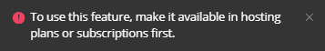
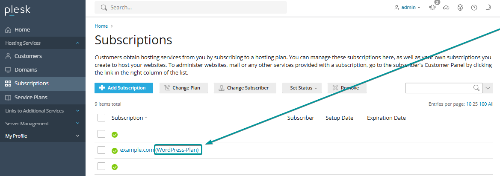
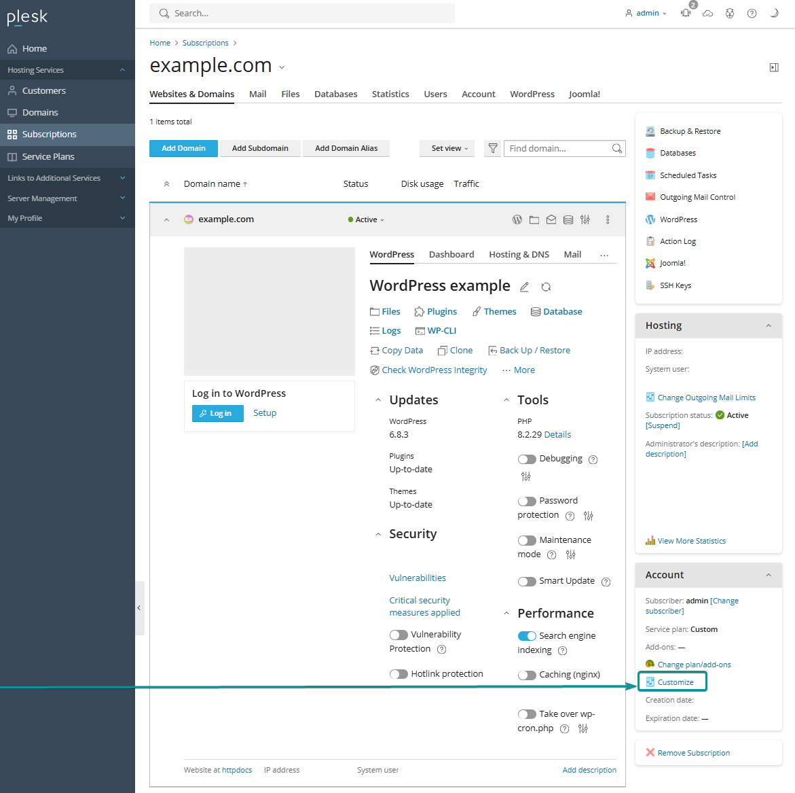

##What Is WP Guardian?

WP Guardian is a **paid add-on** for the WP Toolkit in Plesk. 

It works on the Plesk Web Pro and Web Host editions. 

WP Guardian keeps an eye on your WordPress sites, checking for weak settings, outdated plugins, and known vulnerabilities. When it finds something, it alerts you and offers a simple one-click fix. It also uses trusted intelligence like Patchstack to block threats early. 

The virtual patching protects your site even when you cannot update straight away, and it does this with zero code changes. It is a straightforward way for new and experienced users to stay on top of WordPress security.
_______________________________________________________

##How to enable WP Guardian?

Log in to your Plesk Dashboard, go to WordPress Toolkit, select the desired domain from the list to open its panel, enable the Vulnerability Protection slider.

_______________________________________________________

##Troubleshooting

###Activation error when using a hosting Plan

If you activate the Vulnerability Protection slider in Plesk WordPress Toolkit for the first time after purchasing a WP Guardian license, you'll most probably see this error message at the top of your screen:

The fix is simple, please have a look at the screenshots below:

1. At the bottom-left of the Plesk Dashboard, switch to Service Provider view.

2. Go to Subscriptions and check the service plan used by the subscription (in this case - WordPress-Plan)

!! Since the service plan is not "Custom", we can adjust the plan directly!

!! The change will apply to all the domains using the "WordPress-Plan" service plan!

3. Go to Service Plans, open the corresponding plan, and modify the following setting:

!!! Setting the value to 0 disables vulnerability protection for all WordPress sites under that service plan. (and causing the activation error above)

!!! Setting it to a specific number or Unlimited allows that many (or all) WordPress installations on subscriptions using the plan to use WP Guardian.

_______________________________________________________

###Activation error when using a Custom hosting Plan

If the subscription uses a "Custom" plan, or if you only want to enable WP Guardian for one subscription:

1. Open the subscription

2. In the Account box (on the right), click Customize.

3. Adjust the "WordPress websites with vulnerability protection" setting, as explained in the previous chapter, and click Ok to save.

_________________________________________________________

!!! Switch back to Power User view. (if needed)

!!!! The Vulnerability Protection slider in WordPress Toolkit will now activate successfully

