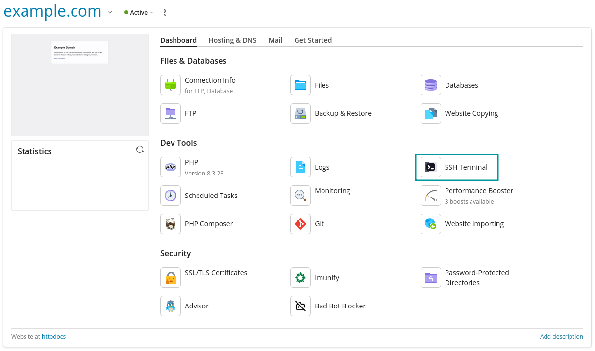

In order to successfully connect to your server / website over SSH you’ll have to:

* Allow SSH access for your domain
* (Optional) - Enable access via port 22 in the firewall, and configure your SSH client

! Note that root access is not provided. The SSH user will be the system user associated with the domain.

## Enable SSH access for your domain

Log in to your **Plesk Dashboard**, go to `Websites & Domains`, then go to `Web Hosting Access` for your domains that you want to connect to. Choose either the **/bin/bash** shell, or the **/bin/bash (chrooted)** shell and save it:

! The chrooted bash shell will set the root folder to the document root of the domain, whereas the non-chrooted shell uses the normal path of **/var/www/vhosts/[domain_name]**.

## Connect via SSH extension

On domains with SSH access enabled, the SSH terminal extension is available, and provides SSH access with no further configuration needed:

## External SSH access

### Enabling access through the firewall

As port 22 is blocked by default in the Plesk firewall, an exception must be made for an external connection to be possible. To adjust the Plesk firewall settings for port 22, you can navigate via Tools & Settings > Firewall > click on **SSH (secure shell) server**.

From there, the port can either be set to **Allow from selected sources, deny from others**, where individual IP addresses can be set as a list of allowed connection sources, or to **Allow**, which will allow all external connections to connect via the SSH port.

### Connect using password

You have to find out the user to be used to establish the connection. For this go to **Web Hosting Access** for domain that you want to connect to.

Open the **Putty** client. In the PuTTY configuration window, into the `Host Name (or IP address)` field enter the username and host name or IP address of your server separated by **@** as well as into the **Saved Sessions** field. Then, click `Save` to save the new session so you can reuse it later. Click the newly saved session then click Open to establish the connection.

### Connect using SSH key pair

Using SSH keys is more convenient and secure than traditional password authentication, therefore we are going to show you how to use SSH key pair for authentication. You’ll have to generate your own key pair, for this follow this guide to [Generate your key pair](../generating-ssh-keys-with-puttygen).

#### SSH Keys Manager extension

Go to **Extensions**, search for `SSH Keys Manager` and click `Get it Free` to install it.

Go to particular subscription to manage SSH keys for access to that subscription via SSH. At right hand side click `SSH Keys`, then click `Add key` to add your public key.

#### Configure the SSH client

We are using PuTTY, a free SSH client for Windows and UNIX platforms. [Download](https://www.chiark.greenend.org.uk/~sgtatham/putty/latest.html) it to your machine and run it.

Double click the PuTTY executable file to launch it. In the PuTTY configuration window, into the `Host Name (or IP address)` field enter the host name or IP address of your server as well as into the `Saved Sessions` field. Then, click `Save` to save the new session so you can reuse it later.

In the `Connection -> SSH -> Auth` section, browse to the private key file (.ppk) you’ve previously generated.

In the `Connection -> Data` section, enter the username ( system user of your domain ) into the `Auto-login username` field, under the `Login details` section.

In the `Session` section, click on the `Save` button to save the current configuration.

Select the session you want to start (in case that you have saved more than one session) and click the `Open` button to open an SSH session to the server.

**PuTTY** will first ask you to confirm the server’s host key and add it to the cache. Go ahead and click `Yes`.

