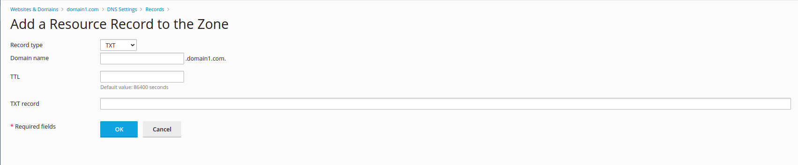

### About SPF record

The **SPF (Sender Policy Framework)** record identifies which mail servers are permitted to send an email on behalf of your domain. It has a key role in preventing spammers from spoofing your domain.To enable SPF, you need to add an SPF record fot your domain name.

To enable SPF, you need to add an SPF record for your domain name. It is a DNS record from the TXT DNS type and it holds the necessary information that allows verifying which e-mail servers are truly authorized to send messages from the name of your domain name.

### How to add an SPF record within Plesk Dashboard?

Access the desired domain, click on the **Hosting & DNS** tab and press **DNS**:

Press the blue **Add Record** button and select **TXT** as record type:

From this point, feel free to fill the **Domain name**, **TXT record**, **TTL** text fields with the necessary information and press the **OK** when you are finished.

Below you can find how a SPF record should look:

> Domain name: example.com

> Type: TXT

> TXT Record: "v=spf1 include:_spf.google.com ~all*"

> TTL: 1 hour(3600 seconds)