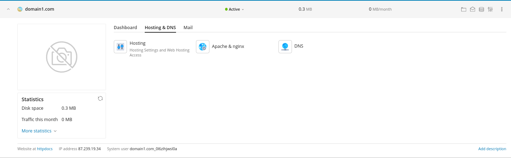

### About TXT Record

The TXT record furnishes textual data accessible to entities beyond your domain, serving both human and machine readership for diverse objectives. Typically, it includes domain particulars alongside crucial information for authentication and email confirmation purposes.

The content within a TXT record serves multifaceted roles. However, its primary utility revolves around:

* **Establishing domain ownership**: Various providers such as Google, Office 365, etc., often mandate the inclusion of a distinct verification code within your DNS zone via TXT record. This process substantiates your ownership of the specific domain.
* **Mitigating email spam**: Additionally, TXT records are frequently employed for SPF, DKIM, and DMARC domain keys, serving as a deterrent against email spam.

### How to add an SPF record within Plesk Dashboard?

Access the desired domain, click on the **Hosting & DNS** tab and press **DNS**:

Press the blue **Add Record** button and select **TXT** as record type:

From this point, feel free to fill the **Domain name**, **TXT record**, **TTL** text fields with the necessary information and press the **OK** when you are finished.

