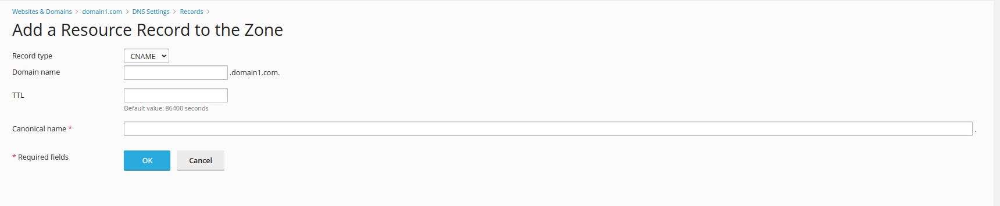

### About CNAME Record

A **CNAME** (Canonical Name) record serves as a pointer within the DNS system, redirecting one domain name to another. It's commonly used to alias one domain to another, allowing for easier management and redirection of web traffic. CNAME records are valuable for simplifying domain setups, such as directing 'www' subdomains to the main domain or pointing multiple domains to a single website.

Below you can find where CNAME records can be used:

* **Subdomain Redirection**: If you have multiple subdomains but want them to all point to a single main domain or another domain, you can use CNAME records to redirect them. For instance, you can point "blog.yourdomain.com" and "shop.yourdomain.com" to "www.yourdomain.com" using CNAME records, simplifying management and ensuring consistency across your web properties.

* **Load Balancing and Failover**: CNAME records are useful for load balancing and failover scenarios. You can use them to direct traffic to different servers or hosting providers based on availability or load. This allows for efficient resource utilization and ensures continuity of service even in the event of server failures.

* **Content Delivery Networks (CDNs)**: When using CDNs to serve content from distributed servers around the world, CNAME records can be used to map your domain to the CDN's network. This ensures that users accessing your website or web application are automatically routed to the nearest CDN server, improving performance and reducing latency.

### How to add a CNAME record within Plesk Dashboard?

Access the desired domain, click on the **Hosting & DNS** tab and press **DNS**:

Press the blue **Add Record** button and select **CNAME** as record type:

From this point, feel free to fill the **Domain name**, **Canonical Name**, **TTL** text fields with the necessary information and press the **OK** when you are finished.
