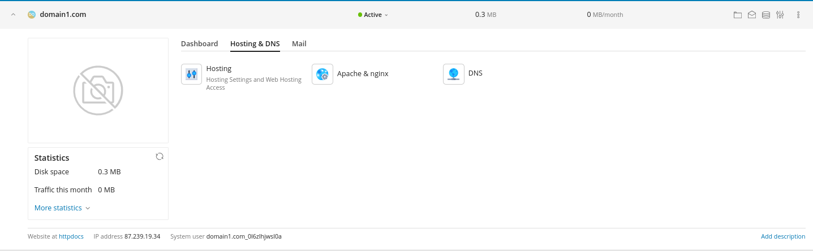
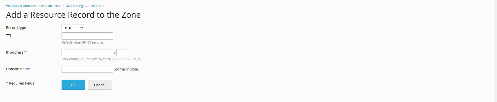

### About PTR Records

**PTR** records, also known as **Pointer** records, facilitate **Reverse DNS** (Domain Name System) lookups, enabling the retrieval of associated domain names or hostnames using an IP address. Every PTR record should correspond to an A record. Employing a reverse DNS configuration for a mail server is an effective strategy.

The PTR record serves to resolve an IP address to a domain or hostname. However, for this process to function correctly, the PTR record must be established within a Reverse DNS zone. While the Primary DNS zone typically associates hostnames with IP addresses, the Reverse DNS zone facilitates the mapping of IP addresses to hostnames.

**PTR records** offer assurance that a specified hostname or domain is linked to the corresponding IP address. They are indispensable for outgoing mail servers because most email providers either reject or flag messages from servers lacking a valid Reverse DNS setup (such as missing PTR records or mismatched A records for the hostname). This practice has become customary as email providers strive to prevent spam from inundating their clients' inboxes. Maintaining proper Reverse DNS configuration is consistently advisable to circumvent potential email filtering issues.

### How to add an PTR record within Plesk Dashboard?

Access the desired domain, click on the **Hosting & DNS** tab and press **DNS**:

Press the blue **Add Record** button and select **PTR** as record type:

From this point, feel free to fill the **Domain name**, **IP address**, **TTL** text fields with the necessary information and press the **OK** when you are finished.