# What's deSEC

deSEC is a registered non-profit organisation based in Germany. They operate a not-for-profit anycast DNS hosting service as part of their mission to drive large-scale adoption of IT security techniques such as DNSSEC. As a non-profit, their service is free to use and sustained entirely through donations and sponsors.

Layershift actively sponsor the deSEC project, and have developed a (free, open source) Plesk extension to make it easy to publish DNS records from Plesk to deSEC.

# What's DNSSEC

DNSSEC ensures that your domain's DNS records cannot be tampered with, so visitors reach your real website instead of a fake one.

[Learn more about DNSSEC at Layershift](../../../domains/dns/configure-dnssec)

# What does the extension do

This extension was built so that you can manage the DNS zone of your domain, without leaving the comfort of Plesk dashboard. This enables you to use deSEC for DNS hosting, benefitting from all of their nice features and security functionality, whilst using Plesk to automate DNS management for your hosted domains.

The main features of the extensions are:

* Automatic push of the DNS records, whenever they are edited, newly created or removed
* One-click domain registration & DNS sync into deSEC
* Customizable domain retention in deSEC, in case you want to remove the domain from Plesk, but keep the DNS zone in deSEC

As an example, I will add the previously registered domain in deSEC called `example10.com` in Plesk and will sync the DNS zone with deSEC. Below is the result of the sync action:

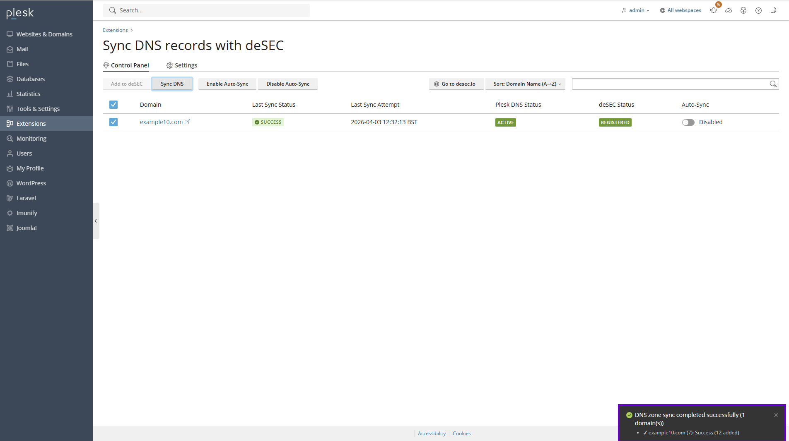

Additionally, if a domain hosted on your Plesk instance hasn't been registered with deSEC yet, you can do so by clicking the Add to deSEC button. Please note that this action does not automatically update the NS records on your domain registrar's side, so that step will still need to be completed manually.

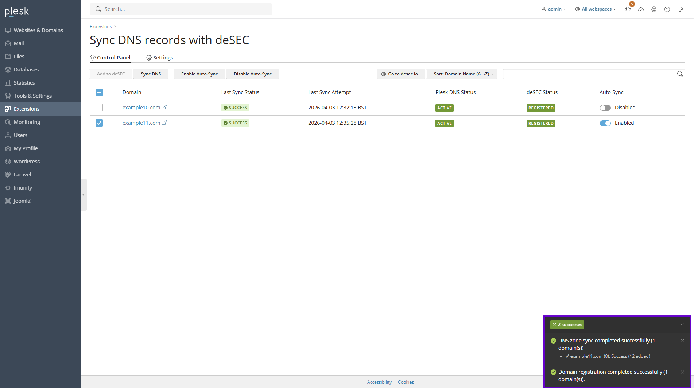

Additionally, once a domain is successfully registered in deSEC, the extension will automatically initiate a sync task, copying the entire DNS zone stored in Plesk and sending it to deSEC. This is why, upon completion, you will see two success messages: one indicating the status of the domain registration task, and the other indicating the status of the sync task. If, for whatever reason, the domain registration task fails, the DNS sync task won't be triggered.

## How does the synchronisation work

As mentioned earlier, this extension allows you to manage your domain's DNS zone directly from your Plesk instance, without needing to access deSEC separately. To achieve this, the extension follows a parent-child synchronization model: the DNS zone in Plesk acts as the parent (the source of truth), while the DNS zone hosted at deSEC acts as the child (the synchronized copy). Any record that is added, removed, or modified on the Plesk side will be automatically reflected on the deSEC side as well.

It is important to note that this sync is **one-directional**. If a DNS record exists on the deSEC side but is not present in Plesk, it will be automatically removed during the next sync. For this reason, we strongly advise against adding, modifying, or removing DNS records directly on the deSEC side while using this extension, as any such changes will be overwritten or deleted.

# How to register a domain with deSEC

In order to register a domain, you can either do it from within the Plesk extension or the deSEC dashboard. All you have to make sure is that the following nameservers are set on the domain registrar side:

* ns1.desec.io.
* ns2.desec.org.

If you want to add the domain in deSEC via dashboard, you can do it by accessing [https://desec.io/domains](https://desec.io/domains) and by pressing the yellow button placed on top right corner of the tab:

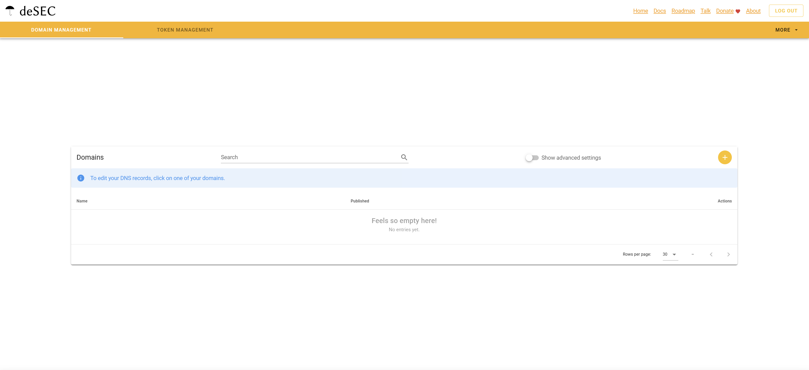

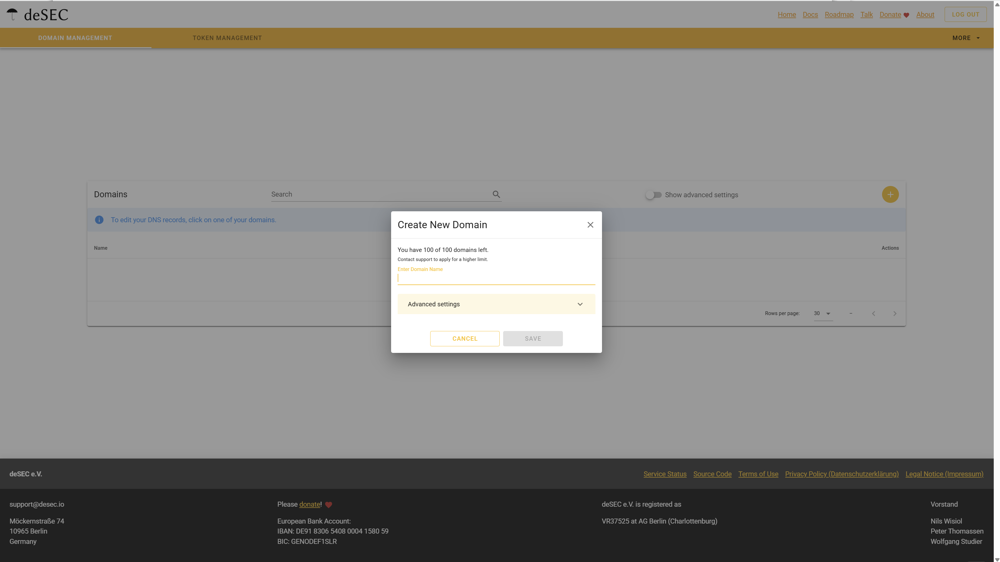

Once you have filled up the domain name field, you will be prompted with the following pop-up screen:

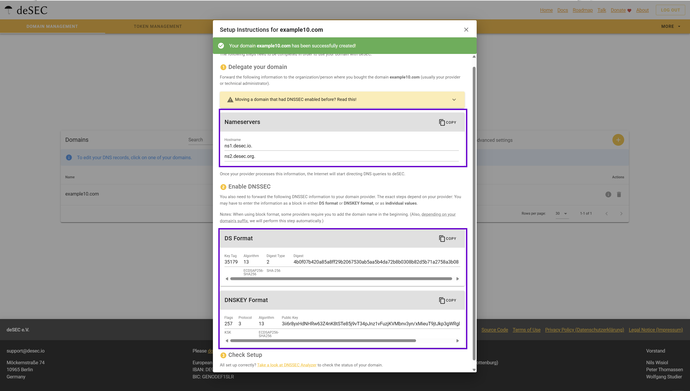

This window displays the DS and DNSKEY records associated with your domain, which are required for DNSSEC configuration. These records need to be added on your domain registrar's side, something we strongly recommend doing to improve the security of your DNS zone. If you'd prefer to set up DNSSEC at a later time, you can safely close this pop-up; the DS and DNSKEY records will remain accessible whenever you are ready to configure DNSSEC.

# How to install the extension

## Automatic installation - the recommended way
 
You can simply install the extension by accessing [https://extensions.layershift.com](https://extensions.layershift.com) and select the deSEC extension from the list. Shortly after that, you will receive an email from `support@desec.io` asking whether you authorise `desec@layershift.com` to manage your domains and DNS zones on your behalf. To grant access, click the link provided in the email. You will be directed through a short setup flow: account creation, a CAPTCHA, and acceptance of the `Terms and Conditions`. Once completed successfully, you will see the following message:

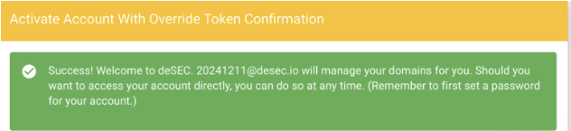

That's it! Now you can access the `Extensions` tab of the Plesk dashboard, and you'll see the deSEC extension installed on your server and ready to be used! Nothing else is requested from your side, all the tasks are done automatically by us!

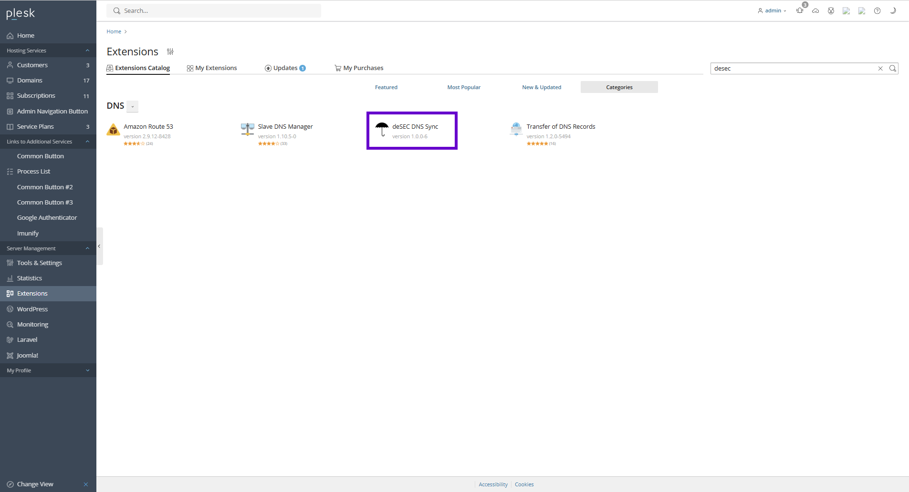

## Manual installation

### Account signup & token creation

! Usually, installing this extension manually is only required if you are not a Layershift customer, but you own a Plesk server and would like to use the extension.

The first step is to visit https://desec.io/signup and create an account. When prompted, select the `No, I'll add one later option`. We'll be registering a domain, but that comes in a later step.

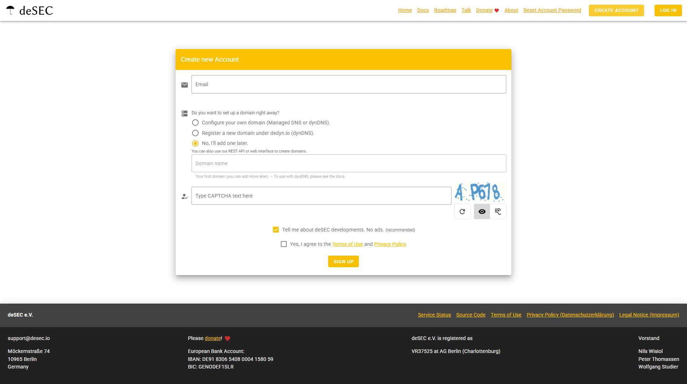

Once you are signed up, you will have to access the dashboard and generate an access token, by acessing [https://desec.io/tokens](https://desec.io/tokens) and press the yellow button placed on top right corner of the tab:

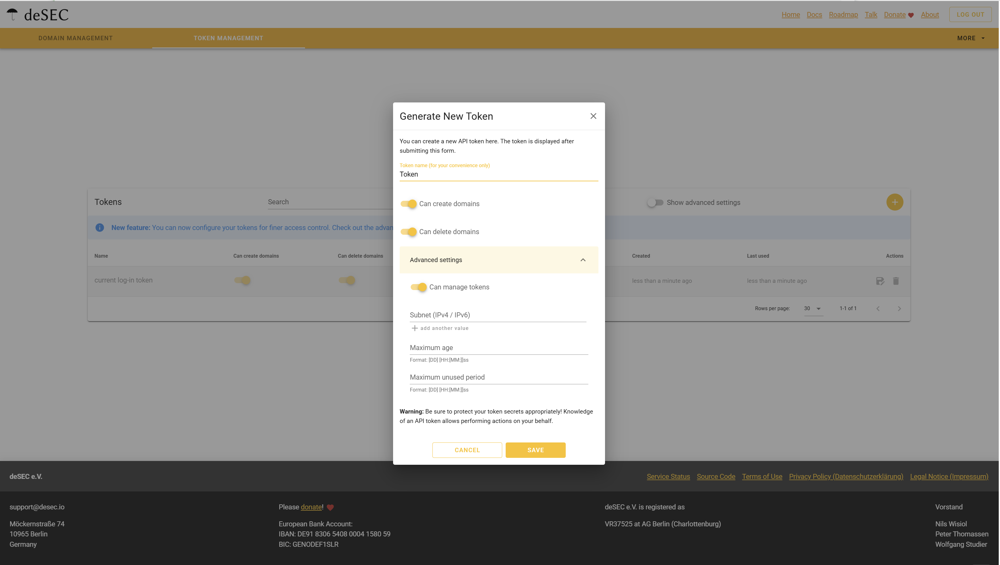

When creating the token, make sure to enable the `Can create domains`, `Can delete domains`, and `Can manage tokens` permissions. Also, you must fill in the `Subnet` field with the IP address of the server(s) that will be sending requests to deSEC(both IPv4 and IPv6 addresses of the server are needed). 

You are all set now, now you can press the `Save` button. Don't forget to copy the provided API token, because once you close the dialog, you'll not be able to see the API token ever again.

### Extension installation & setup

Once you have created the token, feel free to enter the Plesk dashboard, access the `Extensions` tab and search for extension using the `desec` keyword. Once you find the extension, feel free to press the `Get it free` button:

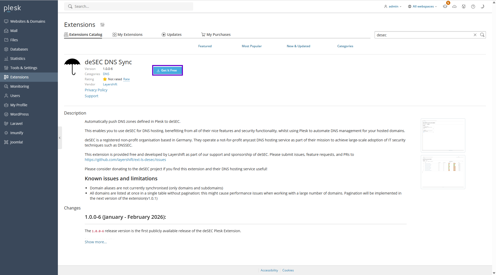

Once installed, please open the extension and you will be prompted with the following form:

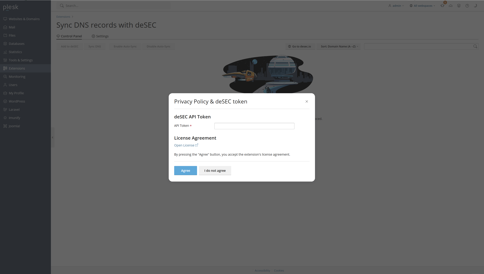

At this step, you will be required to paste the previously generated API token and paste it in the appropriate form and agree with the privacy policy of the extension.

All set! Now you can fully use the features of the extension!
