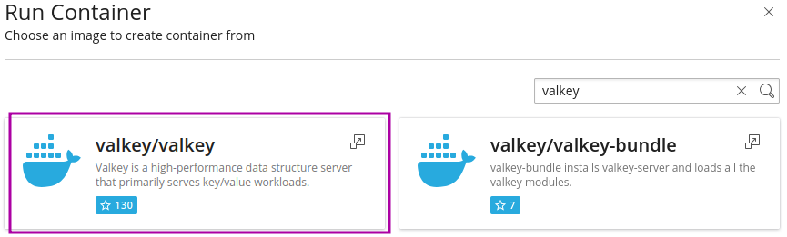
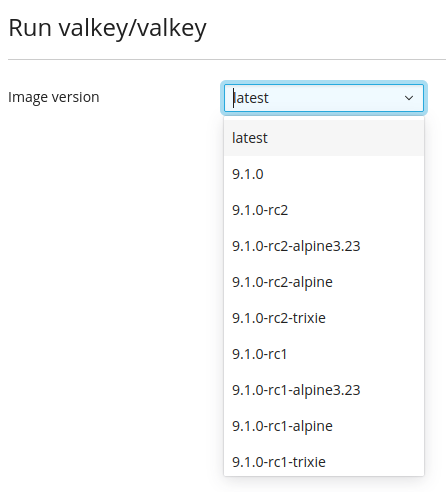
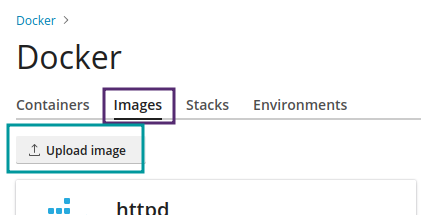
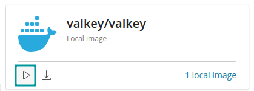
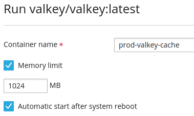
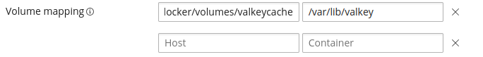
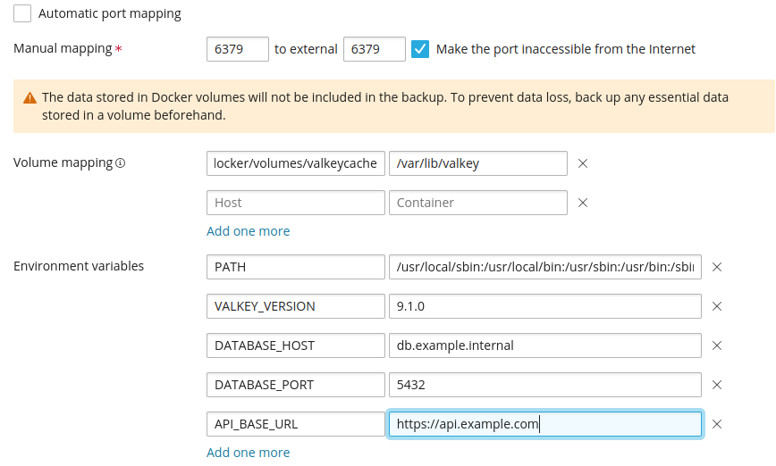
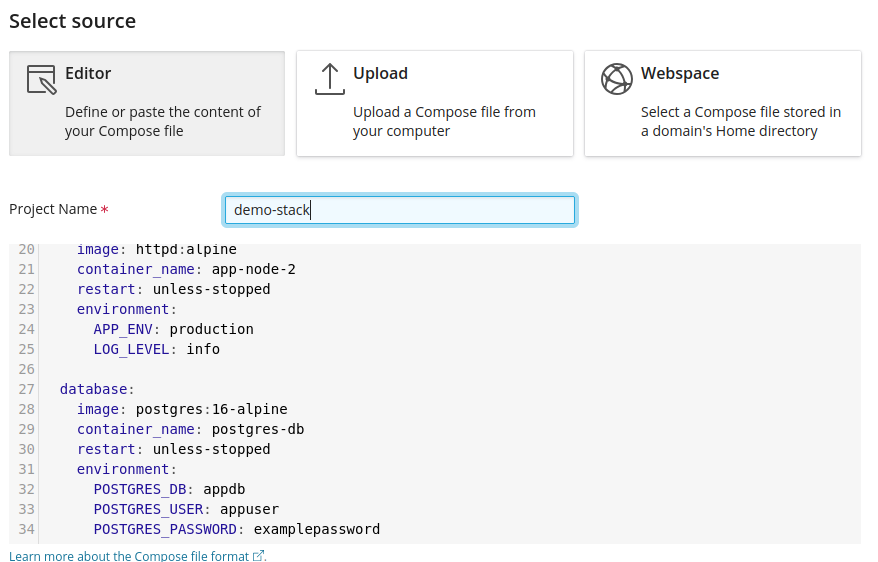
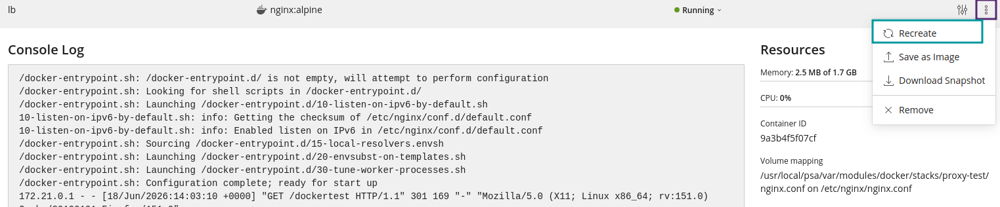

Setting up a Dockerised container might seem complicated, but with Layershift and Plesk it's extremely easy!

### Prerequisites
 
You're likely to need at least 512MiB of free RAM per container, but this may need to be higher depending on workload and image. Keep in mind that each Docker container adds to the overall resource requirements for your server. You can upgrade easily at any time; just reach out to our Support team if you need to add more!

Every Layershift VPS includes regular automated backups. The entire server filesystem is backed up on a frequency and retention scheduled according to your server's backup plan, but depending on your particular Docker image you might want to make additional arrangements, for example some database containers may not be properly restorable from a filesystem backup.

We also recommend that you read the [Plesk Documentation](https://docs.plesk.com/en-US/obsidian/administrator-guide/plesk-administration/using-docker.75823/#setting-up-nginx-to-proxy-requests-from-domains-to-a-container) on the topic, although the below article will help you get setup using Docker on Plesk and if you run into any issues along the way, we have a [24/7 Helpdesk you can contact with your issues](https://help.layershift.com)
 

## Installation
Docker comes pre-installed on all Layershift Plesk servers, so no need for installation. Just look to the left hand panel and you should an option labelled Docker.   
   
If you are unable to see the extension, please contact our [helpdesk](https://help.layershift.com).

### Image Selection
Go to the Docker option in the left hand panel, then Run Container.

 Docker image search pulls images from [Docker Hub](https://hub.docker.com/). Check the Upload Image below for adding your own, or adding images you have sourced from other sources.

  Search for your desired application image > Select specific image > Select version. 
      
Below you can see the image results with the chosen option highlight in purple.      
   

Docker uses the term "Tag" to refer to the version details of a particular image. The version is split into both the numbered version (9.1.0 below) and the named version. Alpine, Trixie, rc2 in the image below.

If you are uncertain which version, use "latest"

Below you can see the various tags
	   
   

#### Upload Image

If you have your own custom images that you would like to use, following the instructions in https://docs.plesk.com/en-US/obsidian/administrator-guide/plesk-administration/using-docker.75823/#o77137.
 
You can now upload that image by going to the purple highlighted Images tab and using the green highlighted Upload, shown below.
 

Once the image is uploaded, you can run that image (or any other local images), by pressing the Run button highlighted in the image below.

Once done, you can follow the instructions below on setting up limits and configuration.

### Memory Limits and Autostart
We now set the container name, any desired memory_limits and auto restart. These are shown in the image below with the memory_limit set to 1024Mb and auto-restart activated.

## Mapping
### Port Mapping
Manual port binding is available if the "Automatic port mapping" button is deselected. You can set both the port you wish inside and outside the container and if you wish the port to accessible from the internet. It is always accessible from the server (127.0.0.1)

 You may have issues with pre-existing services or other containers already using a particular port. This is called a Port Clash and you can mitigate it through using manual port mapping  and setting the port to an appropriate IP.

Two important details, if you need anything routed to that container, make sure to point your application at the correct port. The second detail is to avoid reserved ports, below are the three groupings of port types. you will need to avoid the Well Known and Dynamic ports. Additionally, you will need to ensure that the Registered ports you do use are not already being in use. For example on a Plesk server port 8443 and 3306 will always be in use.

Well-Known (0–1023): Locked for essential global protocols like DNS (53) and DHCP (67).

Registered (1024–49151): Assigned to specific software vendors upon request (e.g., MySQL on 3306).

Dynamic (49152–65535): Used as short-lived ephemeral ports by an operating system for outbound client communication.

### Volume Mapping
Please disregard the error message. Your volumes will be backed up according to your servers backup license and schedule.

You must use absolute paths in both entries.

Below we have a mapping for 

/var/lib/docker/volumes/valkeycache > /var/lib/valkey.

### Environmental Variables
Below you can examples of port, volume and environmental variable mapping.

## Docker-compose

Should you wish to run a docker-compose.yaml file and setup a whole stack like the below. There are multiple ways you can upload your compose file.

Click on Add Stack or the blue plus shown in the image above.
 
You can paste, upload or select the file depending upon your needs. Set the name, it must be in lower case but can container '-' and numbers
 

 
We can see in the image above that the container is stopped, and by going into the highlighted Settings we can edit the container and fix it.
 

 
We can see that there is a clash since something is already using port 80. So we can edit to a different port, save and restart the container. Click on Stopped and select Start.
 
If it fails, you will receive an error message in the top right corner of your dashboard.
 

 
 
  
##   Firewall and Domain Proxy
### Firewall Checks

Please refer to [Plesk Documentation](https://docs.plesk.com/en-US/obsidian/administrator-guide/plesk-administration/plesk-for-linux-the-plesk-firewall.72046/) regarding firewall management.

Note that if a container is NOT set to "Make the port inaccessible to the internet" it will be accessible from the internet on that port, including if you have that port blocked in the firewall.

If you set the container port to be accessible, it creates the firewall rule for you. But we recommend that you check on the rule and confirm the correct port is open.

### Domain Proxying

Domain proxying is an extremely useful feature of Plesk Docker.

You can have all or part of your website served from a container.

This is achieved by having NGINX forward the URL to a mapped external container port.

For more information on setting this up, [please see the extensive Plesk documentation on the setup.](https://docs.plesk.com/en-US/obsidian/administrator-guide/plesk-administration/using-docker.75823/#setting-up-nginx-to-proxy-requests-from-domains-to-a-container)

Please note that the above is for setting up docker as the site root.

Should you wish to only have a part of your website hosted through docker, for example a members area or for different departments, this can be quite easily achieved but does require some finesse.
worldsbestbusiness.com could take you to the home page, you can then have worldsbestbusiness.com/singapore or worldsbestbusiness.com/members
Since Plesk allows for the easy setup of subdomains, you can even have a container for accounting.worldsbestbusiness.com/compliance.

Where this can really shine is when combined with the previously mentioned Docker Stack. Behind the subdirectories listed above, you can have entire docker clusters and essentially a wholly different website including separate database.

To do this, setup a docker stack according to the instructions above, however you must include a mapped volume on the web facing container with the below within your yaml. Please note that since the yaml file will be contained in the directory "/usr/local/psa/var/modules/docker/stacks/your-stack-name/" you can have a relative path for the server side.

> volumes:
>       - ./nginx.conf:/etc/nginx/nginx.conf
      
Once your stack is started, delete ""/usr/local/psa/var/modules/docker/stacks/your-stack-name/nginx.conf". Since this did not exist at the time of the stacks creation, Docker helpfully made a directory there, but we need an nginx.conf file to redirect from the domains subdirectory to root within the stack. Therefore once you have removed the erroneously created folder, you will need to add a file there containing something similar to the below.  Upstream is required to point to application servers behind a load balancer, and in the case below the site would be example.com/dockertest/

> events { worker_connections 1024; }
> 
> http {
>     upstream my_apps {
>         server app-node-1:80;
>         server app-node-2:80;
>     }
> 
>     server {
>         listen 80;
> 
>         location /dockertest/ {
>             proxy_pass http://my_apps/;
>             proxy_set_header Host $host;
>             proxy_set_header X-Real-IP $remote_addr;
>             proxy_set_header X-Forwarded-For $proxy_add_x_forwarded_for;
>             proxy_set_header X-Forwarded-Proto $scheme;
>         }
>     }
> }
  
  
When that file is in place, recreate your web facing container.

Et voila! You now have part of your website hosted on docker and completely separate from the rest of your website, this is excellent for both reducing attack surface, defense in depth as well as any operational considerations.

##  Removal
  
Stopping or removing a stack can be done through the highlighted button below.
  

## Portainer

[Portainer](https://docs.portainer.io/) hides the complexity of managing containers behind an easy-to-use UI. By removing the need to use the CLI, write YAML or understand manifests, Portainer makes deploying apps and troubleshooting problems so easy that anyone can do it.
  
##   Support
Due to the extremely large number of images and versions available, we do not offer support for internal container issues.

We do offer support for the setup of Docker on Plesk, Plesk and server related issues you may experience while installing and operating your containers.
  
##   License
Should you wish to manage multiple Docker servers from a single point, you will need to purchase the Remote Docker license. For more information please see the documentation or contact Support.

You do not need a license to manage the Docker service running on your Layershift Plesk server.
