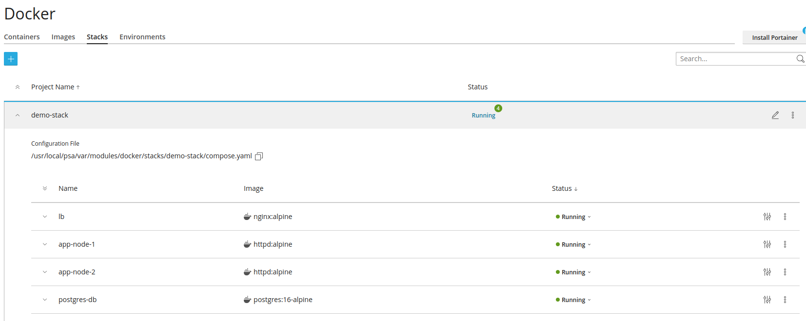
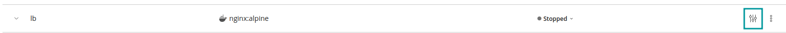
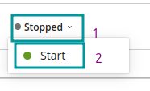

Docker Compose allows you to define and run multi-container applications (e.g. an application and its dependencies). In particular, you might find third party applications packaged in this manner.

Plesk enables you to easily utilise the Docker Compose file provided by those applications (or to write your own, for your own applications).

You can write/paste a Docker Compose file directly in the editor, upload one from your computer, or use one that's already located in a webspace on the server.

Click the `Stacks` tab and then the blue `+` (add stack) icon to get started:

After saving your Docker Compose file, Plesk will execute it, and if all containers are declared `Healthy`, the project will be listed in the `Stacks` page as `Running`. You can expand the project to see 

the status of each individual container:

!!! If there's a problem, the provided output from `docker compose up` may help you to understand the reason, and you'll likely notice that one or more of your newly created containers are `stopped`.
 
You can paste, upload or select the file depending upon your needs. Set the name, it must be in lower case but can container '-' and numbers

## Troubleshooting
If your Stack doesn't launch smoothly:
Review the docker compose up output

!!!! You can re-deploy an existing Stack via the vertical ellipsis (kebab menu) icon

Start the problem container (if it fails to start it may output an error)

Review the container's console log

## Port Conflicts
One possible scenario, especially with third party Docker Compose files - since they don't know the rest of your setup, is that your Docker Compose is attempting to use a port that's already in use by another service or container.
 

 
We can see in the image above that the container is stopped, and by going into the highlighted Settings we can edit the container and fix it.
 

 
We can see that there is a clash since something is already using port 80. So we can edit to a different port, save and restart the container. Click on Stopped and select Start.
 
If it fails, you will receive an error message in the top right corner of your dashboard.
 

 