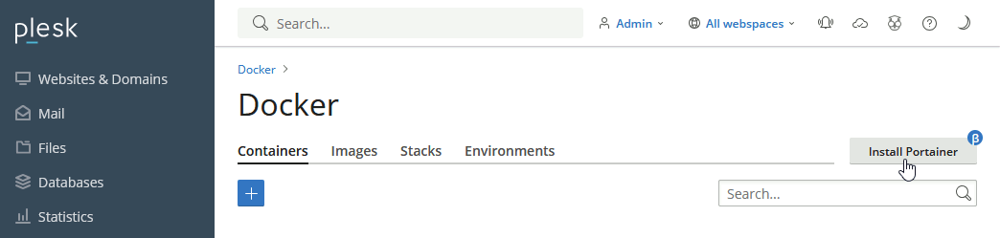

[Portainer](https://docs.portainer.io/) hides the complexity of managing containers behind an easy-to-use UI. By removing the need to use the CLI, write YAML or understand manifests, Portainer makes deploying apps and troubleshooting problems so easy that anyone can do it.

It can be deplyed and accessed directly from the Plesk Docker interface
