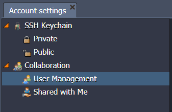
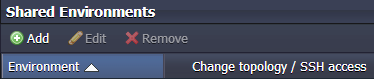

Sometimes you need to provide a third party with access to your environment – that might be a consultant, a freelance developer, or just another member of your development team. Enscale gives you an easy and secure way to handle this requirement – avoiding the risks caused by sharing a single user account between multiple people, and providing a better separation of responsibilities and permissions.

## Overview

All aspects of account collaboration are managed via the Account settings > Collaboration option. Look for  at the top-right of the dashboard, to open the Account settings tab as shown below:

User Management allows you to define which users you want to grant access to your account; you can  users to work with you,  how they’re displayed in your user list, giving each user a nickname or alias so that you can identify them more easily, and  to completely remove them from your account.

You can then select each user to configure which environments from your account are shared with them, and which permissions they’re granted. This enables you to share different environments with different users, and give each a different level of access according to your needs.

## Inviting users to collaborate

Simply click  and enter the user’s email address. It doesn’t matter whether the user has an existing account on Jelastic or not; either way they can still collaborate with you, and any other environments they wish to create on their own account will remain completely separate.

!!! Collaborator accounts have a special status and unlike trial accounts, they do not expire.
!!! However, if you share your environment(s) with a trial user, this collaborator will lose access to the environment(s) once the trial period is over. To continue using the platform, they will need to upgrade to a paid account or contact our billing team to manually convert their user to a collaborator account.

You can optionally allow collaborative users to create new environments on your account. These environments will be owned by you, and therefore the corresponding usage charges will be debited from your account instead of the user who created them.

!!! Enscale sends an email notification to the person you invite, with a link they must click to accept the invitation and begin collaborating with you.

## Specifying shared environments

You will be notified when a user accepts your invitation, at which point they will be added to the user list in your dashboard. No environments are shared by default, and you must configure them (per user) after the invitation is accepted.

Select a user from your list, and use the Add button to define which environment(s) to share. You can either select an individual environment, or use the ‘all environments’ option to share all existing environments in your account with this user.

From June 2022, you can now share environment groups as well as individual environments, and define your own granular permissions sets (roles) to suit your specific business needs.
