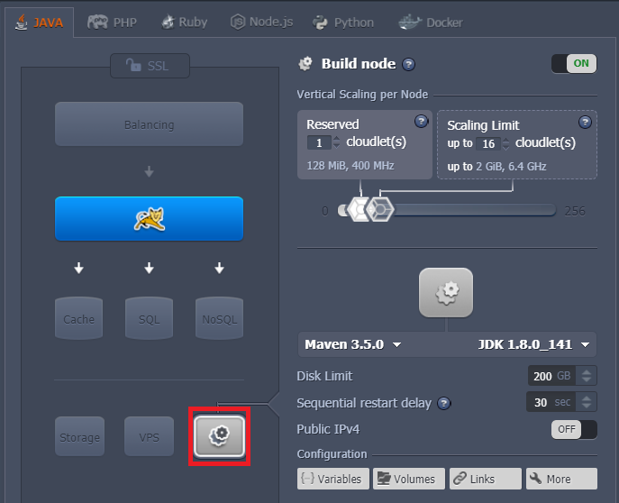
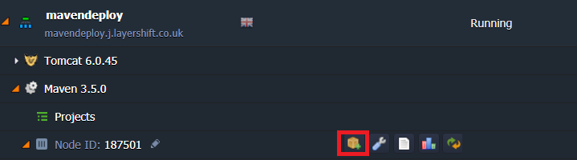
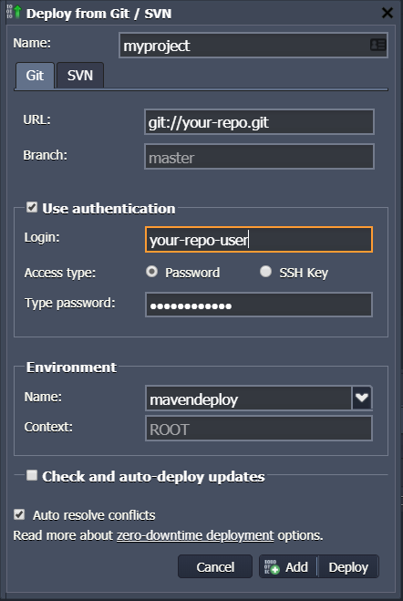
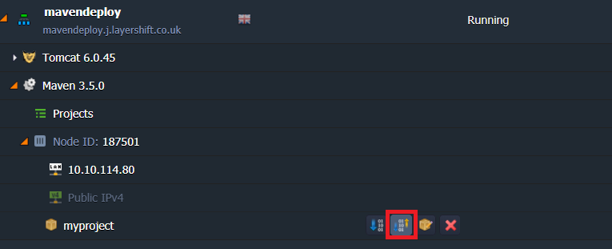

Source control management tools such as git and Subversion are widely used by individual freelancers and collaborative distributed development teams alike.

We made it really easy for you to deploy straight from your code repository to your Enscale environment to give you the fastest and easiest deployment process.

## Deployment steps

### Log in to your Jelastic dashboard

Ok, it’s obvious, but to get started you need to Log In to Enscale. We’re going to assume that you’ve already created a new Enscale Java environment with your choice of Tomcat, GlassFish, Jetty or TomEE application servers. If you haven’t, just hit  and do that now.

### Add a maven build node

Add an Apache Maven build node to your environment if you didn’t already, as highlighted at the bottom of this screenshot:

!!! It’s a good idea to set the Scaling Limit for Maven quite high; it has to do a lot of intensive processing, so the higher you set the Scaling Limit the faster it’ll run. (You pay for the average CPU consumption per hour, so a higher Scaling Limit can actually work out cheaper for you here since you’ll use a large amount of CPU for just a short time – this is also why it’s much better to build your Java project on our powerful server hardware instead of in your coding lab).

### Add your project repository

Now you just need to tell us where your repository lives. That can be absolutely anywhere you like on the Internet; Bitbucket, GitHub, Google Code, or even your own in-house system, as long as you’re using either git or SVN (need a different SCM? Let us know and maybe we can add support in future!).

Expand your environment to view each of the individual servers (using the  icon at the left-hand side of your environment’s name), and then select the Add Project  button as shown below

Give your project any name (it’s just for your own reference).

Select your repository type (git or SVN) using the tabs, and enter the connection details.

#### git connection details:

Path: _the path to your git repository_  
Branch: _the repository branch you wish to checkout and build_  
Login: _repository username (leave blank if not required)_  
Password: _repository password (leave blank if not required)_  

#### SVN connection details:

Path: _the path to your SVN repository (in SVN any branch or tag forms part of the URL)_  
Login: _repository username (leave blank if not required)_  
Password: _repository password (leave blank if not required)_  

Finally you need to specify which environment you want to deploy to and the context name. The default ‘ROOT’ here means your code will be deployed to http://maven-example.j.layershift.co.uk/ If you wish to deploy to http://maven.j.layershift.co.uk/example/ just enter example as the environment context.

When everything is perfect, click ‘Add’ to complete the process.

### Build and deploy

The last step is to build and deploy your new project. Maven will connect to your repository, checkout the latest code, build it, and publish it to your environment – all at the click of a single button; awesome! Here’s where you can find that magic little button:

