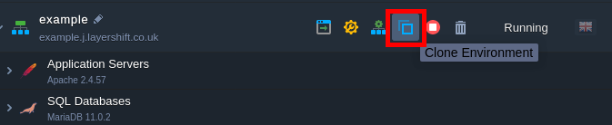
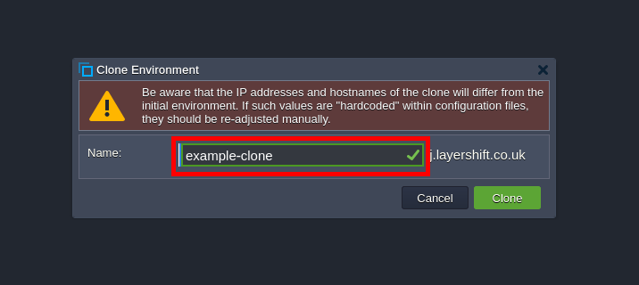
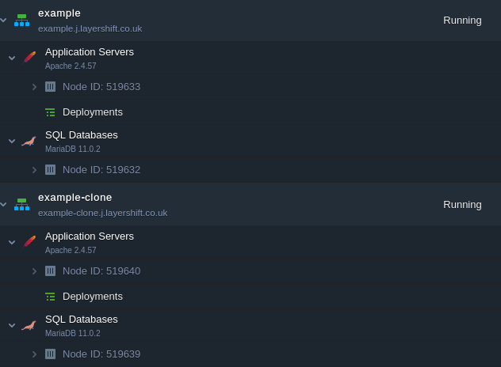

# Clone Environment

It’s good practice to validate all of your changes on a stage environment before deploying them to your live site or application. That way you find any last minute problems before they impact your users. Doing this is usually a lot of extra work, so this vital step is often skipped in favour of time saving, but with Enscale we’ve made it easy – there’s no more excuses!

===

## How to create a clone of your Enscale environment

1. Log in to your Enscale dashboard, and press the Clone Environment button on the environment that you wish to clone:

2. Enter a name for the new clone of your environment, and Clone to start the process:

!! Each server within your source environment will be stopped briefly and restarted during the cloning process (required to ensure data consistency).

!!! It takes several minutes for the cloning process to be completed, depending on the amount of data and number of servers within your environment.

When the cloning process is completed, you will have 2 environments with exactly the same data and server configurations:

3. Update your application connection strings

Everything is copied exactly as-is. The only changes are the IP addresses of the cloned servers (i.e. they are allocated new, distinct IPs vs. the ones used by the live environment). Therefore any database servers have the databases and users, and your applications remain configured to connect to the original IP address / hostname corresponding to the live server!

!! If you do not manually update your application connection strings, you will be inadvertently connecting to the live environment – any changes you make to the database could impact your live application.

! We recommend also updating the usernames in your cloned environment to make it very clear and avoid any potential for errors.

## That’s all

Cloning your entire live server environment takes just 3 easy steps.

Now you can easily create an exact copy of your live environment to effortlessly test new functionality, architecture, or configurations without risk of impact to your live servers. Best of all, since you only pay for resources consumed each hour, it only costs a few pence to perform these critical tests!