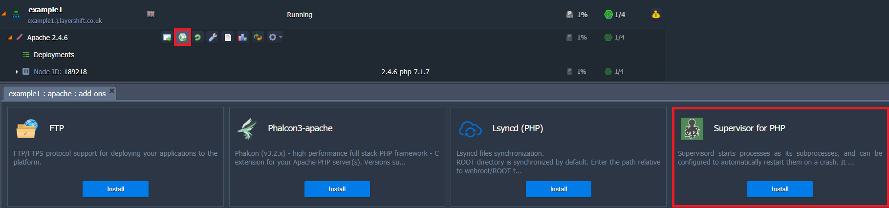
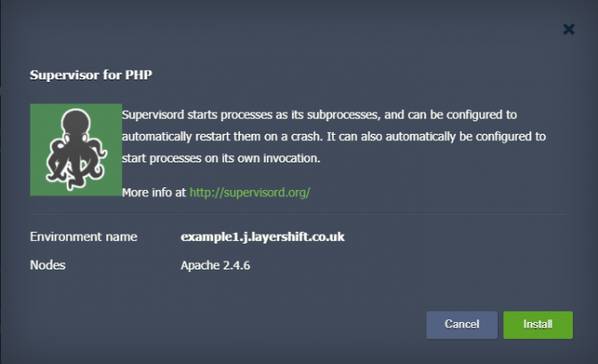
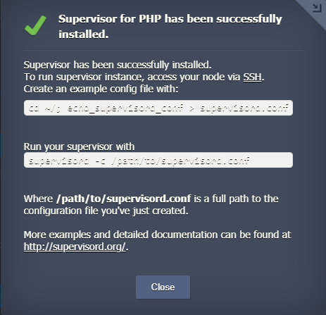
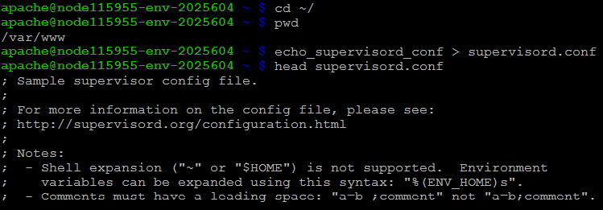
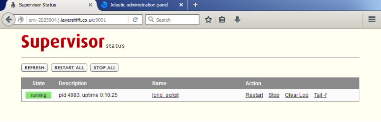

Many applications call for a background script to be kept running in order to perform certain important housekeeping tasks. As developers we like to write these scripts using the language we find convenient for the task at hand, which means it’s common for them to be in PHP or node.js. Neither are particularly good at long running scripts, so they need a little supervision to ultimately ensure their reliability.  Such scripts cannot be monitored all the time by yourself, as the process of watching the output and checking if the script is still working would be tedious and time-consuming.

To make your work easier and focus on the things that matter, you need an automated watcher for those scripts. Such tools are called process watchers. Their job is to monitor a process and perform specified actions, e.g. on system boot or script error.

What might I use to supervise my applications? Well, most processes that are installed on your system already have various mechanisms implemented for process watching. For instance Upstart or Systemd. Those tools are used by the system to monitor important processes, such as your webserver, mail service, and so on. System level packages are much less likely to fail without notice thanks to those watcher mechanisms.

Managing system-wide monitor mechanisms might, however, be a difficult task and you, as a developer, would not want to stain your hands with init scripts for each of your programs; all in all, you are the one who has a web application to maintain, not the system! A simpler solution to monitor your own scripts in an easy way would be much preferred. Here’s where Supervisor enters the game.

[Supervisor](https://supervisord.org/) is a process manager that makes managing a number of long-running programs a very easy task. It provides you with a consistent interface through which you can control and monitor your processes.

This tutorial will show you how to install Supervisor inside your PHP application environment and give you basics on how to manage this tool.

## Installation

The installation process, thanks to our one-click Add-on tool, is very simple. To install Supervisor, click on the Add-ons icon next to your Apache or Nginx node. You will see, among other available add-ons, Supervisor for PHP. Click Install button to proceed with the installation:



You will then be presented with the add-on description window which will give you brief information about Supervisor:



Once you click Install, Supervisor will start its installation into your PHP node. 

On successful installation, you will see a confirmation screen with information on how to make an initial configuration of Supervisor:



The same information will be emailed to you.

## Configuration

Following the configuration instructions from the email, log into your Apache or Nginx node via [Enscale gateway](../../ssh/enscale-ssh-access#connect-to-the-ssh-gatewa) and issue the following commands:

cd ~/
echo_supervisord_conf > supervisord.conf

This will create an initial configuration file under your application user home directory:



You can now start using supervisor by issuing the following command:
```
supervisord -c /var/www/supervisord.conf
```
and check if the supervisor process is running:
```
apache@node115955-env-2025604 ~ $ ps auxfwww|grep supervisor
apache 4982  0.0  2.0 219272 10828 ?     Ss   09:20   0:00 /usr/bin/python /bin/supervisord -c /var/www/supervisord.conf
```
Now you are ready to monitor your first script!

## Supervising and controlling processes

### Script configuration

As an example, we will use a very simple script that, once running, will print current date to stdout and ‘error!’ to stderr every second. Let’s create a file named long.sh under our system user home directory:
```
apache@node115955-env-2025604 ~ $ vim ~/long.sh

#!/bin/bash
while true
do
# Echo current date to stdout
echo `date`
# Echo 'error!' to stderr
echo 'error!' >&2
sleep 1
done
```

Save the file with ``:wq``

and make it executable: ``chmod +x ~/long.sh``

Now, time to configure the script inside Supervisor configuration file. To keep things neat and tidy, you can create a separate directory where you will keep configuration files only for specified script. In order to enable this function, first create a directory called supervisor:

```
apache@node115955-env-2025604 ~ $ mkdir ~/supervisor
```

and edit main supervisord.conf file and at the end of the file insert:

```
[include]
files = /var/www/supervisor/*.ini
```

This directive will tell Supervisor to look for additional configuration files under the directory. Now, once it’s done, let’s create the configuration file for our first script:

```
apache@node115955-env-2025604 ~ $ vim ~/supervisor/running_script.ini
```
Insert the below to the file:
```
[program:running_script]
command=/var/www/long.sh
autostart=true
autorestart=true
stderr_logfile=/var/www/long.err.log
stdout_logfile=/var/www/long.out.log
```
Save the file with ``:wq``

**Let’s have a look at the above lines:**

The first two lines describe process type and it’s name (this can be set to any name you want) as well as the command to run:
```
[program:running_script]
command=/var/www/long.sh
```
The next two lines define automatic behaviour if the script under certain conditions:
```
autostart=true
autorestart=true
```
autostart option tells supervisor that this program should be started when the system boots. Setting it to false will require manual start. autorestart defines how Supervisor should manage a program in the event of exit. There are three options:
* false – tells supervisor not to restart the program on exit
* true – tells supervisor to restart the program on exit
* unexpected – tells Supervisor to restart the program only if there was an unexpected error on exit (by default, anything other than codes 0 and 2)

The final two lines define locations for error and output log files:
```
stderr_logfile=/var/www/long.err.log
stdout_logfile=/var/www/long.out.log
```
The above configuration is a minimum for a program to run under Supervisor. The [official documentation](https://supervisord.org/configuration.html#program-x-section-settings) enlists more options that are available to fine tune program execution.

### Supervising our first script

Once we have the configuration and script ready, we can start it with supervisorctl. If supervisord process is already running, there’s no need to kill and restart it. On any change or addition of a configuration file, you should execute the following commands:

To make Supervisor check for configuration changes and load new one if they exist:
```
apache@node115955-env-2025604 ~ $ supervisorctl reread
```
To enact any changes:
```
apache@node115955-env-2025604 ~ $ supervisorctl update
```
At this point, our long script should be running and we can check this by tailing the output log file:
```
apache@node115955-env-2025604 ~ $ tail -f long.out.log
Fri Jan 22 12:02:58 UTC 2016
Fri Jan 22 12:02:59 UTC 2016
Fri Jan 22 12:03:00 UTC 2016
Fri Jan 22 12:03:01 UTC 2016
Fri Jan 22 12:03:02 UTC 2016
Fri Jan 22 12:03:03 UTC 2016
Fri Jan 22 12:03:04 UTC 2016
Fri Jan 22 12:03:05 UTC 2016
```
As well as checking process list.

## Controlling Programs

Once our scripts are running, there will definitely be a time when we want to stop, restart or check status of those scripts. The [supervisorctl](https://supervisord.org/running.html#running-supervisorctl) tool that we’ve already used in the above example, has an interactive mode thanks to which you can control your programs.

To enter the interactive mode, type supervisorctl without any arguments:
```
apache@node115955-env-2025604 ~ $ supervisorctl
running_script                   RUNNING   pid 26213, uptime 0:29:29
supervisor>
```
Once started, it will initially print status and uptime of all programs running. Enter help to reveal all available commands:
```
supervisor> help
default commands (type help <topic>):
=====================================
add exit   open  reload  restart   start   tail
avail  fg     pid   remove  shutdown  status  update
clear  maintail  quit  reread  signal stop version
```

Now, we can start, stop and restart a program with corresponding command followed by program name:
```
 supervisor> stop running_script
 running_script: stopped
 supervisor> start running_script
 running_script: started
 supervisor> restart running_script
 running_script: stopped
 running_script: started
```
You may also view the most recent entries from stdout and stderr logs using tail command:
```
supervisor> tail running_script
Fri Jan 22 15:37:19 UTC 2016
Fri Jan 22 15:37:20 UTC 2016
Fri Jan 22 15:37:21 UTC 2016
Fri Jan 22 15:37:22 UTC 2016
Fri Jan 22 15:37:23 UTC 2016
```
```
supervisor> tail running_script stderr
error!
error!
error!
error!
error!
```

Checking program status after making changes is easy as well:
```
supervisor> status
running_script                   RUNNING   pid 26213, uptime 3:40:16
```

## Web interface

You can also configure a web interface which is bundled with Supervisor. This will let you see a list of all processes being monitored, as well as take actions on them (restart, stop, clear logs, check output). Remember to secure the web interface with a password to prevent unauthorized person to access it!

To configure web interface, you need to add a public IP to your Apache or Nginx node as well as add the following lines to your Supervisor configuration:
```
[inet_http_server]
  port = *:9001
  username = user ; Basic auth username
  password = pass ; Basic auth password
```

After you apply changes to your Supervisor process, you will be able to access the interface by pointing your web browser to port 9001 of your environment:



## Set supervisord to start at boot

To make your supervisor start at boot, add the following line to your crontab:
```
@reboot /bin/supervisord -c /full/path/to/supervisord.conf
```