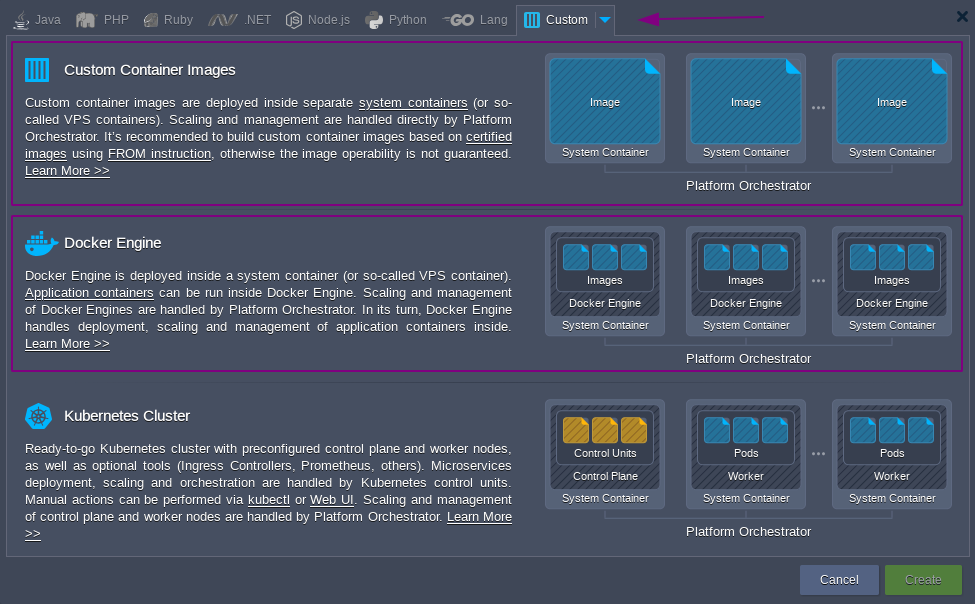

Docker containers can be deployed on Enscale in two different ways, each with their own benefits and drawbacks:

# Deploying as a Custom Container

This uses the Docker image as a template, and uses it to deploy a platform-native container.

Benefits:
* The resulting container more closely resembles other (i.e. certified) containers on the platform, and more platform functionality is available (such as the built-in vertical and horizontal scaling).
* Docker-related functionality such as Volumes, Environment Variables, and Links are managed via the platform UI, in the same way as for certified containers - providing a consistent way to manage these aspects across all nodes, regardless of their origin.
* It's a more "plug and play" experience; for example you can use such containers as application nodes with automatically configured load balancing via any of the certified container load balancer type nodes. This is a common deployment topology for security reasons (e.g. easy to add an SSL certificate to an nginx load balancer node, and then firewall the custom docker-based container(s) to only accept requests on the expected port(s) from the load balancer(s)).

Drawbacks:
* The Docker image must be based on one of the [supported operating systems](https://www.virtuozzo.com/application-platform-docs/container-image-requirements/)

# Deploying on-top of Docker Engine

The platform offers the ability to create Docker Engine CE nodes where you can use native Docker features including Docker Compose, swarm clusters, and Portainer.

Benefits:
* All standard Docker features are available (i.e. everything is as per Docker's own documentation)
* Docker images can be based on any OS

Drawbacks:
* Additional networking quirks due to the multi-layered virtualization
* Docker-specific firewall chains must be managed manually to secure hosted Docker containers.