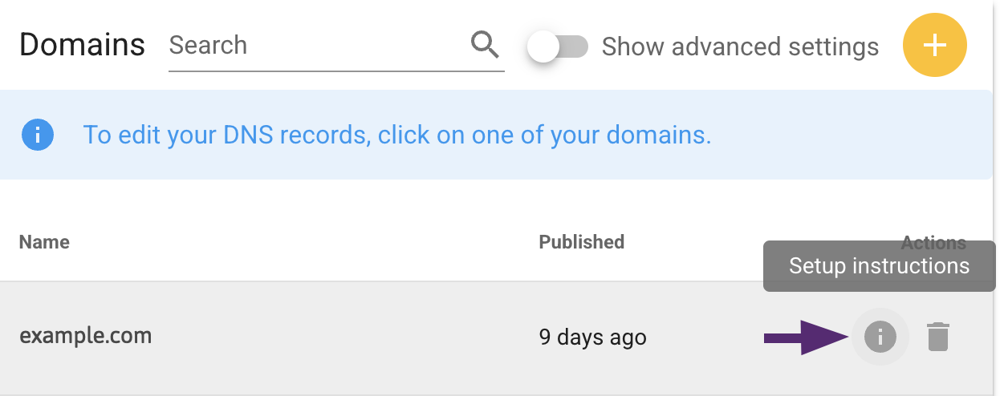
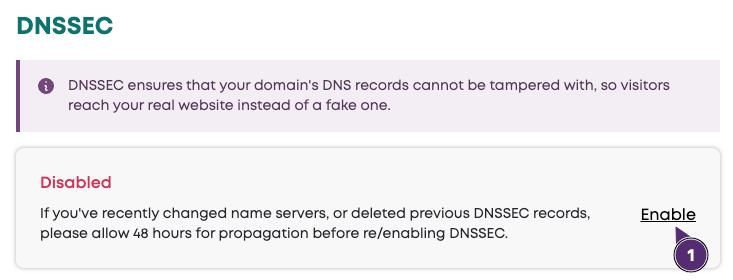
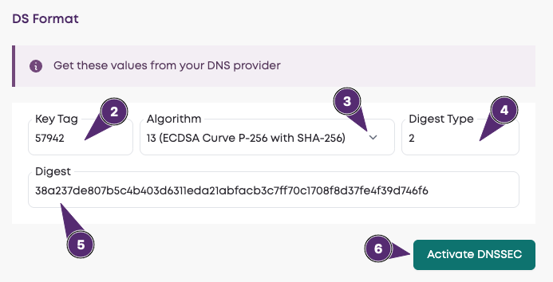
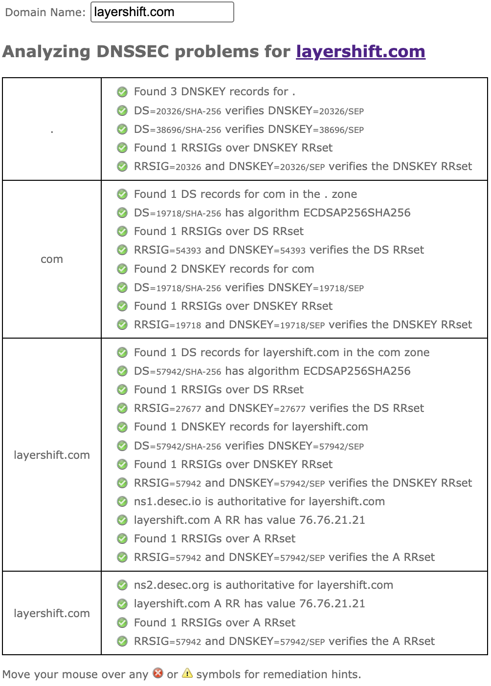
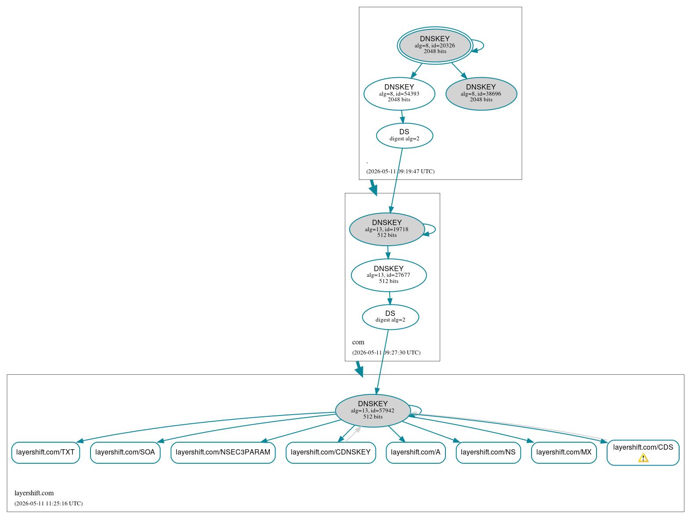
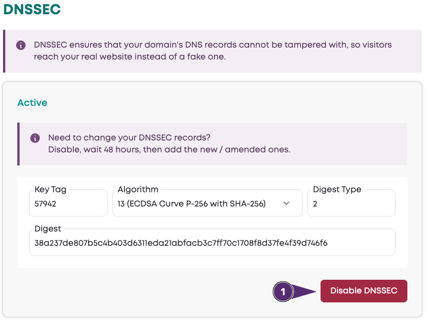

# What is DNSSEC?
DNSSEC secures the **DNS information** that you publish for your domain, similar to HTTPS secures the **content** of your website. It allows someone receiving DNS results for your domain to be sure that the DNS information they receive is exactly as you published it.

Without DNSSEC, a visitor can potentially be tricked into communicating with a malicious server by providing them with false DNS results.

DNSSEC makes sure that your visitors reach your real website, not a fake one!

# How does DNSSEC work?
When your computer needs to perform a DNS lookup, it asks a special type of DNS server called a resolver to go find the answer. 

The resolver makes a series of requests:
* Starting with the root servers, which signposts the resolver to;
* The servers of the particular TLD, which signposts the resolver to;
* Your authoritative name servers for the domain.

DNSSEC enables each of those steps to be cryptographically signed, so that the resolver can verify that the answers it gets back are real.

# How to enable DNSSEC?
To enable DNSSEC, you have to publish a special signing record called a Delegation Signer (DS) record at the domain registry of the particular TLD (domain extension) responsible for your domain - similar to how you set your domain's name servers.

Because the DS record contains a cryptographic hash of you domain's DNSKEY record (which is published by your name servers), its value comes from your DNS server / provider.

## Step 1: Get your DS record
Therefore the first step is to consult your DNS provider to obtain the DS record.

!!! A DS record has several parts:
!!! * Key Tag (a number between 0-65536)
!!! * Algorithm (various algorithms are available, represented by different numbers)
!!! * Digest Type (various digest types are available, represented by different numbers)
!!! * Digest (a string of numbers and letters)

! You might be given the DS record as individual values, or a sequence of values separated by spaces. If the latter, they will be in the order described above: the first is the key tag, the next is the algorithm etc.

At Layershift, you can use DNSSEC in conjunction with the [deSEC Plesk extension](../../../managed-vps/dns/desec-integration-with-plesk) and obtain your DS record in the setup instructions as shown below:

## Step 2: Publish the DS record to the domain registrar
! **WARNING**: If you've recently changed your name servers, you should allow 48 hours for that change to propagate before publishing a DS record - otherwise your domain may be offline for some visitors!

The process for this step depends on your domain registrar.

### For domains registered with Layershift
If you register your domains with Layershift, you can do this in your [Customer Dashboard](https://dashboard.layershift.com) via Domains > domain name > Manage.

Scroll down the page to find the DNSSEC heading:
* The current status is indicated (**Disabled** or **Active**); 
* Click **Enable** to reveal the **DS format** fields

Enter the **DS format** values, and then click **Activate DNSSEC**:

## Step 3: Verify the results
!! If your DNSSEC records are incorrect, your domain will be inaccessible!

Here are some useful third party DNSSEC checker tools:
* [Verisign DNSSEC analyzer](https://dnssec-analyzer.verisignlabs.com)
* [DNSViz](https://dnsviz.net)

If all is well, it should look similar to these:

!!! The DNSViz warning for `CDS` is normal / expected, and [explained further here](https://talk.desec.io/t/how-to-sort-out-a-problem-related-to-the-rfc-7344-sec-3-sec-5/1051)

# How to change the DS record
! **WARNING**: If you change DNS provider, you need to handle the DS record **BEFORE** you change name servers (or your domain will stop resolving).
!
! There are more complicated ways, but the safest way to proceed is:
! * Disable/delete the current DS record
! * Wait 48 hours for DNS propagation
! * Change name servers to your new DNS provider
! * Wait 48 hours for DNS propagation
! * Configure the new DS record

Domain registrars do not usually provide any mechanism to **edit** a DS record, because doing so is likely to cause you problems due to propagation delays. 

Instead, the recommended approach is:
* Delete the existing DS record
* Wait 48 hours for propagation
* Add the new/modified DS record back

## For domains registered with Layershift
If you register your domains with Layershift, you can do this in your [Customer Dashboard](https://dashboard.layershift.com) via Domains > domain name > Manage.

Scroll down the page to find the DNSSEC heading:
* The current status is indicated (**Disabled** or **Active**)
* If **Active**, the currently published DS record values are displayed
* Click **Disable DNSSEC** to delete the existing DS record
* Wait 48 hours for DNS propagation before adding a new / modified record back

